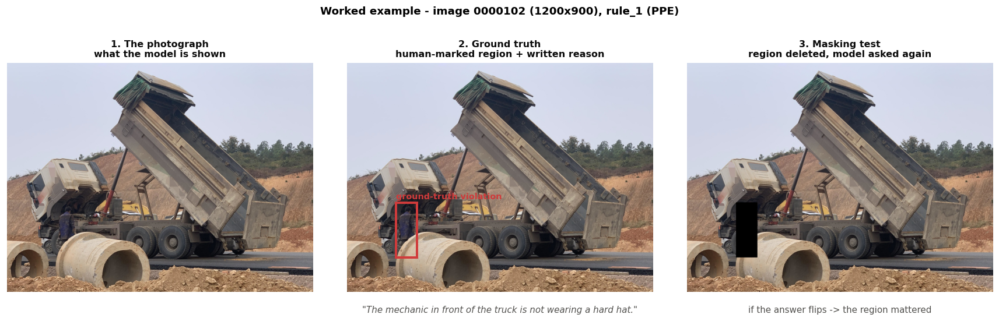
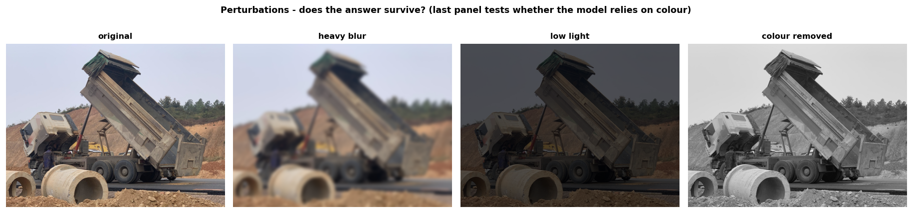

# Explainable AI for Construction-Site Safety: Study Architecture

**Version 2.0 — 9 August 2026**

A self-contained methodology document. It assumes no knowledge of this codebase and no
prior familiarity with vision-language models. Anyone reading it should be able to
implement the study from scratch, understand what each stage produces, and know how to
read the results.

> **Changes in v2.0.** The Florence-2 "geometric proxy" arm has been **removed**. Defining
> safety rules through box-distance heuristics proved too convoluted to defend, and a
> question-answering model does the job directly. The study is now a **comparison across
> several open question-answering models**, which is a stronger contribution than
> proxy-versus-model. Sampling has moved to a **two-stratum design with reweighting**
> (§5.3), masking has been made **architecture-aware** (§2.7), and the model tier is now
> **7B at 4-bit** with a 3B-at-8-bit fallback (§7).

---

## Table of contents

1. [Objective](#1-objective)
2. [Background knowledge you need first](#2-background-knowledge-you-need-first)
3. [Why we are rebuilding the study](#3-why-we-are-rebuilding-the-study)
4. [What we are building](#4-what-we-are-building)
5. [The data](#5-the-data)
6. [The safety rules](#6-the-safety-rules)
7. [The models](#7-the-models)
8. [The pipeline, stage by stage](#8-the-pipeline-stage-by-stage)
9. [Output files and their schemas](#9-output-files-and-their-schemas)
10. [How to interpret the results](#10-how-to-interpret-the-results)
11. [Statistical treatment](#11-statistical-treatment)
12. [Risks and how we retire them](#12-risks-and-how-we-retire-them)
13. [Execution order and time budget](#13-execution-order-and-time-budget)
14. [Glossary](#14-glossary)

---

## 1. Objective

### 1.1 The question

> When an AI system looks at a construction-site photograph and says *"this is unsafe"*,
> can we trust the explanation it gives for that judgement?

Not *"is the answer correct?"* — that is ordinary accuracy. The question is whether the
**explanation** is trustworthy. That is a different and harder thing to measure.

### 1.2 Why it matters

Construction safety is a domain where a wrong call has physical consequences, and where a
human supervisor must be able to audit the machine. A system that says "unsafe" without a
checkable reason cannot be deployed responsibly. So the explanation is not decoration — it
is the part that makes the system usable at all.

### 1.3 What we produce

#### A worked example first

Everything below refers to one real photograph from the dataset, image `0000102`:



The middle panel shows what a **human annotator** recorded: a region, and a written reason —
*"The mechanic in front of the truck is not wearing a hard hat."* That human reason is the
yardstick we grade the machine against.

Now we show the same photograph to a model and ask:

> *"Is any worker missing required personal protective equipment?"*

and require a structured reply:

```
ANSWER: YES
REGION: (192, 549, 276, 765)
REASON: The man working beside the truck cab has no hard hat on.
```

#### The seven numbers, against that one image

Each metric asks a different question about that reply. The values shown are
**illustrative** — the study has not been run yet — but they show exactly what each number
would mean for this photograph.

| # | Metric | What it asks *about this image* | How it is obtained | Example |
|---|---|---|---|---|
| 1 | **Descriptive Accuracy** | If we delete the mechanic from the photo, does the model stop saying YES? | Black out `REGION`, ask again (right-hand panel above) | Answer flips YES→NO ⇒ **1** for this image |
| 2 | **Sparsity** | Was the model's attention concentrated on the mechanic, or spread over the whole truck? | Read internal attention over image patches | Gini **0.71** — fairly focused |
| 3 | **Stability** | Ask five times — does it always say YES? | 5 sampled re-runs | 5/5 agree ⇒ **1.00** |
| 4 | **Efficiency** | How long did that answer take? | Wall-clock timing | **3.2 s** |
| 5 | **Robustness** | Does it still say YES in poor light, blurred, desaturated? | Re-ask on degraded copies | survives 3 of 4 ⇒ **0.75** |
| 6 | **Bounded Completeness** | Did it point anywhere at all, and did that region matter? | Combine 1 and the region source | region given + flip ⇒ **supported** |
| 7 | **Explanation Correctness** | Does *"man beside the truck cab, no hard hat"* mean the same as *"mechanic in front of the truck, not wearing a hard hat"*? | Text similarity + hazard match + box overlap | sim **0.88**, same hazard, IoU **0.63** ⇒ **correct** |

Metrics 1 and 6 ask *did the model really use what it claims to have used* — **faithfulness**.
Metric 7 asks *was what it claimed actually true* — **correctness**. Metrics 2–5 describe
how usable, consistent and affordable the system is. §2.5 makes this split precise.

Averaged over thousands of images, each becomes a percentage with a confidence interval,
broken down by hazard type.

#### The comparison: which model, and how much better?

We run the identical battery on **three open question-answering models**:

| role | model | why it is in the study |
|---|---|---|
| **primary** | Qwen2.5-VL-7B-Instruct (4-bit) | largest that fits the available GPU |
| **size comparison** | Qwen2.5-VL-3B-Instruct (8-bit) | same family, smaller — isolates the effect of *scale* |
| **family comparison** | InternVL2.5-4B (4-bit) | different lineage — isolates the effect of *model family* |

Because the only thing that changes is the model, differences in the seven numbers are
attributable to the model rather than to the measuring instrument.

**How "how much better" is stated.** For image `0000102` above, suppose:

```
Qwen-7B :  ANSWER YES   REASON "man beside the truck cab has no hard hat"   → correct
Qwen-3B :  ANSWER YES   REASON "a worker is present on the site"            → too vague, incorrect
InternVL:  ANSWER YES   REASON "the truck is unsafe"                        → wrong subject, incorrect
```

All three got the **answer** right. Only one got the **explanation** right. Aggregated,
that becomes a table:

```
metric                    Qwen-7B          Qwen-3B          InternVL-4B
answer accuracy           0.78             0.74             0.71
explanation correctness   0.61             0.38             0.34
descriptive accuracy      0.59             0.44             0.41
```

The headline finding is the **gap between answer accuracy and explanation quality**, and
how it varies by model. A model can be right for the wrong reason, and that table is what
makes it visible.

### 1.4 Success criteria

The study succeeds if it can answer all four of these with evidence:

1. Does the model's stated reason match the real reason the scene is unsafe?
2. When we remove the region the model says it relied on, does its answer actually change?
3. Do the answers and explanations survive realistic degradation — poor light, blur,
   occlusion, loss of colour?
4. How much does explanation quality depend on which model you pick, and on its size?

---

## 2. Background knowledge you need first

Short, plain-language explanations of every concept used later. Skip any you know.

### 2.1 What a vision-language model is

A **vision-language model (VLM)** is a neural network that takes an *image* plus *text* and
produces *text*. Think of it as a system you can show a photo and ask a question about.

```
   [photo of a building site]  +  "Is anyone not wearing a hard hat?"
                              ↓
                        [ the VLM ]
                              ↓
              "Yes — the worker on the left has no helmet."
```

Internally there are two halves:

- A **vision encoder** chops the image into a grid of small squares called **patches**
  (typically 14×14 pixels each) and turns every patch into a list of numbers describing
  what is in it. These are called **image tokens**.
- A **language decoder** reads those image tokens together with your question, and writes
  out an answer one word-piece at a time.

You do not need the mathematics. You need three facts, all of which matter later:

1. The model sees the image as a **grid of patches**, not as objects. Any statement about
   "where it looked" is ultimately about which patches mattered.
2. The image becomes **tokens before the language half ever runs.** This is what makes the
   token-ablation masking in §2.7 possible.
3. The model writes its answer **one token at a time**, each conditioned on the previous
   ones — which is why decoding settings change the output.

### 2.2 Tokens and decoding

A **token** is a chunk of text — roughly a word or part of a word. `"guardrail"` might be
two tokens, `"guard"` + `"rail"`.

When generating, at each step the model produces a probability for every possible next
token. Something must choose one. That procedure is **decoding**.

#### Example A — beam search with N = 1 (this is exactly "greedy")

Keep only the single best option at every step. Once a token is chosen it can never be
reconsidered.

```
step 1    candidates:  "The"(0.60)   "A"(0.30)   "Two"(0.10)
          KEEP: "The"                                    ← 1 survivor
          (discarded forever: "A", "Two")

step 2    extend "The":  "The site"(0.55)   "The worker"(0.45)
          KEEP: "The site"                               ← 1 survivor

step 3    extend "The site":  "The site is safe"(0.70)  "The site has"(0.30)
          KEEP: "The site is safe"

FINAL:    "The site is safe."     total score 0.60 × 0.55 × 0.70 = 0.231
```

#### Example B — beam search with N = 2

Keep the **two** best partial sentences at every step, extend both, then re-select the best
two from all continuations.

```
step 1    candidates:  "The"(0.60)   "A"(0.30)   "Two"(0.10)
          KEEP: "The", "A"                               ← 2 survivors

step 2    extend BOTH:
              "The site"(0.60×0.55 = 0.330)
              "The worker"(0.60×0.45 = 0.270)
              "A worker"(0.30×0.80 = 0.240)
              "A crane"(0.30×0.20 = 0.060)
          KEEP the best two: "The site"(0.330), "The worker"(0.270)

step 3    extend BOTH:
              "The site is safe"(0.330×0.70 = 0.231)
              "The site has"(0.330×0.30 = 0.099)
              "The worker has no hat"(0.270×0.90 = 0.243)   ← overtakes!
              "The worker is fine"(0.270×0.10 = 0.027)
          KEEP the best two: "The worker has no hat"(0.243), "The site is safe"(0.231)

FINAL:    "The worker has no hat."   total score 0.243
```

#### What the difference actually means

Both started with `"The"` as the single most likely first token. But `"The worker…"` was
only the *second*-best option at step 2, so **N=1 threw it away and could never get it
back** — even though it eventually led to the better sentence.

This is the central property: greedy decoding is **locally** optimal at every step and can
therefore be **globally** wrong. Beam search delays commitment, letting a temporarily
weaker path overtake later.

For this study it matters in two ways. Beam search gives better-worded rationales, which
matters because we grade the wording. But it is also more expensive — roughly *N* times the
computation — and, on some architectures, it reorders internal state in ways that make
attention harder to read. We therefore use **greedy for attention extraction** and **beam
for the answers we grade**, and say so wherever numbers from the two are compared.

A third mode, **sampling**, picks randomly in proportion to probability. It is deliberately
non-deterministic and exists solely so the Stability metric has something to measure — with
greedy or beam decoding, repeated runs would be identical and would score perfectly stable
by construction, proving nothing.

> **Terminology warning.** "Beam" in *beam search* has **nothing to do with structural
> beams or girders.** It is a metaphor from a torch beam sweeping across possibilities. In
> a construction-safety document this is worth stating explicitly.

### 2.3 Grounding, and how it differs from question answering

Two different things a VLM might do:

- **Visual question answering (VQA):** ask a question in English, get an English answer.
  *"Is this worker wearing a harness?"* → *"No."*
- **Grounding:** give a noun phrase, get back **bounding boxes** — rectangles marking where
  that thing appears. *"hard hat"* → `[(750, 540, 775, 555)]`.

A **bounding box** is four numbers: left, top, right, bottom pixel coordinates.

```
      (x0,y0) ┌──────────┐
              │  hard hat│
              └──────────┘ (x1,y1)
```

The models in this study do **both**, which is what makes the design work: we ask the
question in English *and* require a region, so we get an answer and a pointer to its
evidence in one reply.

### 2.4 What "explainability" means here

An **explanation** has two parts:

1. **A region** — a bounding box saying *"this is the part of the image I relied on."*
2. **A rationale** — a sentence saying *"here is why, in words."*

Having an explanation is not the same as having a *good* one. A model can point at the sky
and say "the worker is unsafe" — that is an explanation, and it is worthless. The whole
study exists to measure the difference.

### 2.5 Faithfulness and correctness — and exactly how each is quantified

This is the conceptual core, so it is worth being precise. Two things can be wrong with an
explanation, and they are **independent**.

**Faithfulness** — does the explanation reflect what the model *actually used*? A model
might say "I looked at the worker's head" while its decision was really driven by the
overall colour of the image. An unfaithful explanation is a false account of the model's
own process, even when the answer is right.

**Correctness** — does the explanation match *reality*? A model might faithfully report
relying on the worker's head, while the actual hazard was an unguarded trench elsewhere in
the frame. A faithful explanation can still be wrong about the world.

They combine into four cases, all of which occur in practice:

| | **correct** | **incorrect** |
|---|---|---|
| **faithful** | ✅ the goal | genuinely used the region it named — but it was the wrong region |
| **unfaithful** | named the right region by luck, but did not use it | worst case: wrong *and* dishonest about it |

#### How they become numbers

Not every metric measures explanation validity. Here is the exact mapping, so there is no
ambiguity about what is measuring what:

| concept | metric(s) | operational test | output |
|---|---|---|---|
| **Faithfulness** | **1. Descriptive Accuracy** *(primary)* | delete the named region, re-ask | fraction of cases where the answer changed |
| | **6. Bounded Completeness** *(secondary)* | did a region exist at all, and did deleting it matter? | share classified `explanation_supported` |
| **Correctness** | **7. Explanation Correctness** *(sole)* | compare rationale + region against the human-written reason + region | fraction scored correct on the 3-signal rule in §8 Stage 10 |
| *neither — these describe usability, not validity* | 2. Sparsity | is attention concentrated? | Gini coefficient |
| | 3. Stability | do repeats agree? | pairwise agreement rate |
| | 4. Efficiency | how long? | seconds per call |
| | 5. Robustness | survives degradation? | survival rate per perturbation |

The joint table in §10.1 cross-tabulates metric 1 against metric 7 to place every model in
one of the four cells above. **That cross-tabulation is the study's central result** —
neither number alone can distinguish "right for the right reason" from "right by accident".

### 2.6 The evaluation metrics, in plain words

| # | Metric | The question it asks | Good score means |
|---|---|---|---|
| 1 | **Descriptive Accuracy** | If we delete the region the model relied on, does its answer change? | High — the region was genuinely load-bearing |
| 2 | **Sparsity** | Is attention concentrated on a few places, or smeared everywhere? | High — a focused, readable explanation |
| 3 | **Stability** | Ask repeatedly — same answer? | High — consistent, not arbitrary |
| 4 | **Efficiency** | How long does one evaluation take? | Low — practical to deploy |
| 5 | **Robustness** | Does the answer survive blur, darkness, occlusion, colour loss? | High — works on real site photos |
| 6 | **Bounded Completeness** | Was a usable explanation given, and was it load-bearing? | High — explanations exist and matter |
| 7 | **Explanation Correctness** | Does the written reason match the human-written ground truth? | High — the explanation is *true*, not merely influential |

### 2.7 Masking — and why crude masking is a problem

Several metrics work by **masking**: deliberately removing part of the image and asking
again. If the answer changes, the removed part mattered.

The obvious approach — paint the region black — has a flaw. **A black rectangle is
something no real photograph contains.** The model may react to the strange rectangle
itself rather than to the missing evidence. So a "flip" might mean *"I no longer see the
hard hat"* or merely *"this image now looks broken"*, and those are not the same finding.

Better options exist. Ordered by how strongly this study recommends them:

#### (a) Image-token ablation — the architecturally correct method

Recall from §2.1 that the image becomes **patch tokens** before the language half runs.
Rather than editing pixels, simply **delete the tokens** covering the region.

```
   normal:    [img_1][img_2][img_3][img_4] ... [question] → answer
   ablated:   [img_1][  ✂  ][  ✂  ][img_4] ... [question] → answer
```

No strange pixels are ever created, because no image is ever modified. This is the cleanest
possible statement of "the model could not see this region", and it eliminates the
out-of-distribution artefact entirely.

#### (b) Patch-grid alignment

A mask that cuts a patch in half leaves a partial, ambiguous signal in that patch. Snap all
mask boundaries **outward to patch borders** so every affected patch is fully covered.
Cheap to implement, and it removes a whole class of noise.

#### (c) Colour ablation — a domain-specific test worth running

High-visibility clothing is *defined by its colour*. So: **desaturate the image and ask
again.**



If PPE detection collapses when colour is removed, the model is using a **colour shortcut**
rather than recognising the garment. That is a real safety finding, not a curiosity —
hi-vis in non-standard colours, at dusk, or under sodium lighting would fail in deployment.
No pixel-deletion test can reveal this.

#### (d) Counterfactual insertion — testing sufficiency, not just necessity

Every method above removes evidence and asks *"does the answer break?"* — a test of
**necessity**. The complementary test is to **add** the missing item: inpaint a hard hat
onto a bare head and check whether the verdict flips to compliant.

```
   necessity   : remove the hard hat   → does "compliant" become "violation"?
   sufficiency : add    a hard hat     → does "violation" become "compliant"?
```

A model that passes both is using the equipment itself. A model that passes only the first
may be reacting to any disturbance in that area. Sufficiency is rarely tested in the XAI
literature and is strong evidence when it holds.

#### (e) Fills that are less unusual than black

If pixel masking is used, **mean-colour fill** or **matched noise** sit closer to the
natural image distribution than pure black. **Inpainting** — reconstructing the region from
its surroundings so the object appears never to have been there — is the most realistic and
the most expensive.

#### What this study actually uses

| method | role |
|---|---|
| **black fill, patch-aligned** | primary — comparable with prior work |
| **image-token ablation** | primary — the artefact-free measurement |
| **colour ablation** | robustness — tests the colour shortcut |
| **counterfactual insertion** | subset — tests sufficiency |
| **inpainting** | subset — confirms black-fill results are not an artefact |

Reporting black fill and token ablation side by side is itself informative: **a large gap
between them is a direct measure of how much the black-rectangle artefact was inflating the
result.**

### 2.8 Confidence intervals and why single numbers lie

If you test 10 images and 6 flip, you report 60%. But with 10 images the true rate could
plausibly be anywhere from about 30% to 85%. "60%" alone is misleading.

A **confidence interval** states that range. We compute it by **bootstrapping**: resample
the results many times with replacement, recompute each time, and take the middle 95%.

**Rule: never report a proportion without its interval, and never report a group with fewer
than 30 samples as a headline result.**

---

## 3. Why we are rebuilding the study

### 3.1 What the earlier pilot did

The earlier pilot used **Florence-2-base-ft**, which can ground phrases but has **no way to
answer a free-form question**. Safety rules were therefore answered by a **geometric
workaround**: ground `"worker"`, ground `"hard hat"`, and call it compliant if every worker
had a hard hat box within 8% of the image's longest side.

### 3.2 Why that was abandoned

Three failures, all confirmed by measurement, none fixable by tuning:

**(a) It never checked the object was what was asked for.** The detection call returns boxes
*and labels*; the code kept the boxes and **discarded the labels**. Nothing verified the
returned box was really a hard hat.

**(b) Proximity is not wearing.** The test is *distance between rectangles*. On a
1200-pixel-wide photo the threshold is 96 pixels. So a hard hat **on the ground** near a
worker marked them compliant; a helmet near someone's **feet** passed identically; and
because matching was any-to-any, **one helmet satisfied every worker near it** — three
workers and one hat on the ground scored fully compliant.

**(c) The rule was narrower than what it claimed to measure.** The dataset's `rule_1`
covers PPE *in general* — helmets, high-visibility clothing, long trousers, shoulder
coverage — but the pipeline only ever grounded `"hard hat"`. Measured across 136 real
violations, **16.9% never mention a hard hat at all** and were undetectable by construction.

### 3.3 The decision

Encoding safety rules as box-distance heuristics requires a growing pile of thresholds,
each needing separate justification, and none of them measuring reasoning. **A model that
can be asked the question directly removes the entire apparatus.**

So the proxy approach is **dropped, not re-run**. Its limitations are already documented
and are cited as motivation rather than re-measured. The study becomes a comparison across
question-answering models, where the interesting variable is *which model explains best*
rather than *how badly does a heuristic do*.

---

## 4. What we are building

### 4.1 Three models, one measuring instrument

| role | model | isolates |
|---|---|---|
| **primary** | Qwen2.5-VL-7B-Instruct (4-bit) | — the main result |
| **size comparison** | Qwen2.5-VL-3B-Instruct (8-bit) | effect of model **scale** |
| **family comparison** | InternVL2.5-4B (4-bit) | effect of model **family** |

All three see the same images, are asked the same questions, and are scored by the same
metric code.

### 4.2 The central architectural idea

Define one interface that any model must satisfy:

```
Backend:
    answer(image, rule)     → { verdict, confidence, region, rationale }
    attention(image, rule)  → a grid of numbers, one per image patch
    ablate_tokens(image, region)  → answer with those patch tokens removed
```

Then write one implementation per model, and write every metric **once**, against the
interface.

```
                    ┌──────────────────┐
                    │  metric harness  │   (written once)
                    └────────┬─────────┘
                             │ calls Backend
          ┌──────────────────┼──────────────────┐
   ┌──────▼──────┐    ┌──────▼──────┐    ┌──────▼──────┐
   │  Qwen-7B    │    │  Qwen-3B    │    │ InternVL-4B │
   └─────────────┘    └─────────────┘    └─────────────┘
```

**Why this matters:** if each model had its own metric code, any difference in results could
be a difference in the measuring instrument rather than the model. One shared harness makes
that impossible by construction.

### 4.3 Directory layout

```
studies/
  01-florence2-pilot/     ← the completed pilot, FROZEN. Cited, never re-run.
  02-vlm-xai-study/       ← the new work
      backends/           ← one file per model, all satisfying Backend
      rules/              ← rule definitions and exact question wording
      metrics/            ← the seven metrics, model-agnostic
      scripts/            ← numbered, run in order
      results/            ← output CSVs
      notebooks/          ← walkthrough
docs/architecture/        ← this document
```

The pilot is frozen because it is a scientific record; its published numbers must remain
reproducible.

---

## 5. The data

### 5.1 What the dataset is

**ConstructionSite** — 10,013 photographs of building sites, each annotated by humans with
which safety rules it breaks. Split 7,009 train / 3,004 test.

**We use both.** Nothing here is trained — models are used exactly as downloaded — so the
train/test boundary carries no leakage risk. It exists for people fine-tuning models, which
we are not. Using both roughly doubles the data on rare hazards. *State this explicitly in
any write-up, because a reviewer will ask.*

### 5.2 What one record contains

```
image_id                    "0000102"
image                       the photograph
image_caption               a text description
rule_1_violation            null, OR { bounding_box, reason }
rule_2_violation            null, OR ...
rule_3_violation            null, OR ...
rule_4_violation            null, OR ...
excavator                   list of boxes (may be empty)
rebar                       list of boxes
worker_with_white_hard_hat  list of boxes
illumination                e.g. "daylight"
camera_distance             e.g. "medium"
view                        e.g. "ground level"
quality_of_info             "rich info" or "poor info"   ← see §5.5
```

The critical field:

```
rule_1_violation = {
    bounding_box : [[0.16, 0.61, 0.23, 0.85]],
    reason       : "The mechanic in front of the truck is not wearing a hard hat."
}
```

That `reason` is a **human-written explanation of why the scene is unsafe** — the yardstick
for metric 7. Without it, explanation *correctness* could not be measured at all.

> **Coordinate convention.** Annotation boxes are **normalised** to 0–1 as fractions of
> width and height. Model outputs are in **absolute pixels**. Convert before any comparison.
> Getting this wrong puts every box in the top-left corner — a common, easily-missed bug.
>
> `pixel_x = normalised_x × image_width`

### 5.3 The imbalance, and the two-stratum design

Positive examples per rule, whole dataset:

| rule | hazard | test | train | **total** |
|---|---|---|---|---|
| `rule_1` | PPE | 324 | 677 | **1,001** |
| `rule_3` | edge protection | 63 | 109 | **172** |
| `rule_2` | fall protection | 25 | 59 | **84** |
| `rule_4` | plant proximity | 24 | 46 | **70** |

Images with **any** violation: **1,278 (12.8%)**. With **none**: **8,735 (87.2%)**.

Three facts make this harder than ordinary class imbalance.

**First, "compliant" does not mean "verified safe."** It means *no annotator marked a
violation*. That could be genuinely safe, or missed, or not applicable (nobody at height ⇒
`rule_2` is vacuously satisfied). Given that 47% of images are self-flagged "poor info"
(§5.5), some of those 8,735 certainly contain missed hazards.

**Second — the structural point — most explanation metrics only exist for positive
predictions.** If the model answers *"no violation"*, there is **no region to mask and no
rationale to grade**. Metrics 1, 6 and 7 are **undefined on a NO answer**. Compliant images
therefore cannot contribute to three of the seven metrics no matter how many are run.

**Third, a 50/50 evaluation set is artificial.** Real sites are ~13% violation, so precision
measured on a balanced set overstates real-world precision badly.

#### The design: two strata, measured separately, recombined by reweighting

```
   Stratum H (hazard)      all 1,278 violation images
                           → drives all seven XAI metrics
                           → drives SENSITIVITY (recall)

   Stratum C (compliant)   1,278 compliant images, stratified to match
                           Stratum H on illumination × camera_distance × view
                           → drives SPECIFICITY
                           → drives the FALSE-ALARM / HALLUCINATION rate
```

**Why stratify Stratum C?** If violation photos were mostly night-time and compliant photos
mostly daylight, any measured difference might be about **lighting** rather than **safety** —
a confound. Matching the distributions removes it.

**The false-alarm measurement is a headline number in its own right.** On a genuinely safe
scene, does the model still answer YES — and if so, does it invent a confident region and
rationale for a hazard that does not exist? A system that cries wolf gets switched off by
its users, so this is as operationally important as sensitivity.

#### Reweighting to real-world prevalence

Sensitivity and specificity are properties of the **model** and do not depend on how common
hazards are. Prevalence is a property of the **population**. They combine by Bayes' rule:

```
              sensitivity × prevalence
PPV = ───────────────────────────────────────────────────────────
      sensitivity × prevalence + (1 − specificity) × (1 − prevalence)
```

Worked example, with sensitivity 0.80 and specificity 0.90:

```
measured on the balanced 50/50 set     → precision = 0.89
reweighted to the true 12.8% rate      → precision = 0.54
```

**Same model, same measurements — and the balanced-set figure overstates deployed precision
by 35 points.** Reporting only the balanced number would be misleading; reporting only the
prevalence-weighted one would hide the model's actual discriminative ability. We report both,
labelled.

This yields unbiased discrimination measures, a real false-alarm rate, *and*
deployment-realistic precision — from **2,556 images instead of 10,013**.

### 5.4 The rare-hazard ceiling

There are **70** plant-proximity violations in existence. No sampling strategy creates more.
Every conclusion about that hazard is bounded by that number, its confidence interval will
be wide regardless of method, and the write-up must say so plainly rather than let a reader
over-read a point estimate.

### 5.5 Annotation quality — the reference standard is not perfect

The dataset grades its own annotations:

| `quality_of_info` | images | of which have a violation |
|---|---|---|
| `rich info` | 5,271 | 771 |
| `poor info` | 4,742 | 507 |

**About 47% of the corpus is flagged "poor info" by the annotators themselves.** Three
consequences:

1. Human annotations are treated as a **reference standard**, never as ground truth. The
   distinction matters: disagreement between model and annotation is evidence about *both*.
2. All metrics are reported **split by `quality_of_info`**. If a model scores far better on
   "rich info" images, that tells us the annotations were the limiting factor, not the model.
3. A human audit of **100 randomly drawn images** (50 per quality tier) estimates the
   annotation error rate directly, and that estimate is reported alongside the results.

Inter-annotator agreement is not published for this dataset, so it cannot be quantified —
which is itself a stated limitation.

---

## 6. The safety rules

### 6.1 The four rules as questions

Each rule is defined by the exact wording sent to the model.

**Rule 1 — Personal protective equipment**
> *"Look at every worker in this image. Is any worker missing required personal protective
> equipment — a hard hat, high-visibility clothing, or adequate body covering?"*

**Rule 2 — Fall protection**
> *"Is any worker working at height without fall protection such as a safety harness or
> lanyard?"*

**Rule 3 — Edge protection**
> *"Is there an unprotected edge, excavation, trench, or floor opening that a worker could
> fall into — one lacking guardrails or barriers?"*

**Rule 4 — Plant proximity**
> *"Is any worker inside the danger zone or blind spot of operating heavy machinery, such as
> an excavator?"*

Rule 1 now covers what the annotations actually cover, recovering the 16.9% of PPE
violations the old pipeline could not see.

### 6.2 The response format, and why not "explain briefly"

Every question is followed by this instruction:

```
Answer in exactly this format:

ANSWER: YES or NO
REGION: (x0, y0, x1, y1) pixel coordinates of the single most relevant area, or NONE
REASON: One sentence naming the specific person or location and what is wrong.
```

**Why not "explain briefly"?** It is too vague to grade — one model writes three words,
another writes a paragraph, and the similarity scores in metric 7 become incomparable.

**Why not "explain in 50 words"?** Language models are unreliable at counting words; the
instruction is frequently ignored, and enforcing it wastes retries. More importantly, length
is the wrong thing to constrain.

**Constrain content instead.** *"One sentence naming the specific person or location and
what is wrong"* is enforceable, and it forces the model to produce exactly the two things
metric 7 needs: **a subject** (which worker/where) and **a predicate** (what is wrong). It
makes a vague answer like *"the site is unsafe"* visibly non-compliant with the format
rather than merely unhelpful.

### 6.3 Comparing two texts that mean the same thing

Metric 7 compares the model's `REASON` with the human's `reason`. These will rarely share
wording:

```
human : "The mechanic in front of the truck is not wearing a hard hat."
model : "The man working beside the truck cab has no helmet on."
```

Same meaning, almost no shared words. Three complementary signals resolve this:

| signal | what it catches | weakness |
|---|---|---|
| **Semantic similarity** — embed both sentences, measure the angle between them | paraphrase: *"no helmet"* ≈ *"not wearing a hard hat"* | can be fooled by topically-similar but factually different text |
| **Hazard-type match** — does the rationale name the right category? | gross errors: PPE vs fall hazard | coarse; passes any PPE-flavoured sentence |
| **Spatial agreement** — overlap between the model's `REGION` and the human's box | *where* — the objective anchor | requires the model to give a region |

**The spatial signal is the anchor.** Text similarity is inherently fuzzy; box overlap is
arithmetic. A rationale that reads plausibly but points at the wrong side of the photograph
is caught by geometry even when the text scores highly. This is why the response format
demands a region alongside the sentence.

### 6.4 Which rules get asked of which image

- **Every rule an image violates** is asked. Nothing is discarded to a "priority" ordering.
- **One rule it does not violate** is also asked, at random — a **negative control**
  confirming the model can say NO rather than answering YES to everything.
- **Compliant images** get one or two rules, chosen **context-aware**: never ask about
  excavator proximity in a photo with no machinery annotated, because that question cannot
  be failed and inflates accuracy without measuring anything.

This gives roughly **2 questions per image**, about **5,100 image-rule pairs**.

Replies not matching the required format are retried once; a second failure is recorded as
`unparseable` and excluded, **with the exclusion counted and reported**. Silent parse
failures are how studies quietly lose 15% of their data.

---

## 7. The models

### 7.1 Requirements

| requirement | why |
|---|---|
| answers free-form questions | the entire point — no geometric workaround |
| **also** returns bounding boxes | keeps masking metrics alive and anchors metric 7 |
| open weights | attention must be readable for Sparsity, and tokens ablatable for §2.7(a) |
| fits ~6 GB of VRAM | the available GPU is 8 GB with ~5.7 GB usable |

A closed API model would be stronger at reasoning but would make Sparsity and token
ablation impossible — you cannot inspect or ablate what you cannot access.

### 7.2 Quantisation, and what actually fits

Model weights are normally 16-bit. **Quantisation** stores them in fewer bits, trading some
precision for a large memory saving.

| option | weights | + vision tokens & KV cache | fits 8 GB? |
|---|---|---|---|
| 7B @ 8-bit | ~7.5 GB | ~9 GB | ✗ |
| **7B @ 4-bit** | **~4.2 GB** | **~5.7 GB** | **✓ — primary** |
| **3B @ 8-bit** | **~3.4 GB** | **~4.8 GB** | **✓ — fallback** |
| 3B @ 16-bit | ~6.6 GB | ~8 GB | ✗ |

Two conclusions:

1. **7B at 8-bit does not fit.** The weights alone nearly exhaust the card.
2. **A larger model at 4-bit generally beats a smaller model at 8-bit**, so 7B-4bit is the
   primary and 3B-8bit is both the fallback *and* the size-comparison arm — the same run
   serves both purposes.

> **The real memory lever is resolution, not bit width.** Qwen2.5-VL uses *dynamic
> resolution*: a larger image becomes more patch tokens, and the KV cache grows with them. A
> high-resolution photograph can consume more memory than the weights. `max_pixels` must be
> capped explicitly and **held identical across all three models**, or the comparison is
> confounded by input size rather than model quality.

### 7.3 Where this runs — and why not on Apple Silicon

The work is split across two machines, and the split is forced by hardware, not
preference.

| role | machine | runs |
|---|---|---|
| **compute** | Windows + RTX 3070 (8 GB) | Stage 0 and every model-inference stage |
| **development** | MacBook M1 (8 GB unified) | Stage 1, Stages 9–10, all analysis, figures, writing |

**Model inference cannot be reproduced on Apple Silicon**, for three independent
reasons:

1. **`bitsandbytes` has no Apple Silicon build.** The 4-bit and 8-bit quantisation
   specified in §7.2 is CUDA-only, so the exact model configuration cannot be
   reproduced there.
2. **MLX cannot expose what two metrics need.** MLX *can* run quantised
   Qwen2.5-VL on an M1, but it does not readily expose per-layer attention or
   image-token ablation. Using it would silently drop **Sparsity (metric 2)** and
   the artefact-free masking that **Descriptive Accuracy (metric 1)** depends on —
   the two things §2.7 was written to secure.
3. **Speed.** The M1 GPU is roughly 5–8× slower than the RTX 3070 for this
   workload, turning the ~60 hour budget of §13 into months.

On an 8 GB M1 there is a fourth: unified memory is shared with the operating
system, so a 3B model in fp16 (~6.6 GB) will swap.

**This costs the study nothing.** Every stage writes CSVs, and those are committed,
so statistics, figures and the written report are all produced on the development
machine without touching a model. Only inference needs the CUDA box.

> A consequence worth stating in the write-up: because quantisation is
> CUDA-specific, **the results are tied to the CUDA execution path.** Anyone
> reproducing on Apple Silicon via MLX would get a different quantisation and
> could not compute metrics 1 or 2 as specified. Report the execution environment
> alongside the numbers.

### 7.4 The small-object risk

Hard hats are small. Quantisation *and* resolution capping both attack fine detail — exactly
what `rule_1` depends on. This is the single largest threat to the study's validity, which
is why Stage 0 tests it before anything else is built.

---

## 8. The pipeline, stage by stage

Each stage states: **input → procedure → output → interpretation**.

---

### Stage 0 — Feasibility gate

**Purpose:** kill or rescope the project cheaply, before anything is built.

**Input:** 30 hand-picked images — 10 with clear hard hats, 10 with clear violations, 10
with small or distant workers.

**Procedure:**
1. Load each candidate model at its target quantisation.
2. Ask Rule 1 on each image; record answer, region, rationale.
3. Manually check: are small hard hats found? Are regions roughly right?
4. Time 20 calls for a real seconds-per-call figure.
5. Confirm attention can be extracted and image tokens can be ablated.
6. Record peak VRAM at the chosen `max_pixels`.

**Output:** `stage0_feasibility.csv` plus a go/no-go decision.

**Interpretation — decision rules fixed in advance:**

| finding | decision |
|---|---|
| ≥ 80% of clear hard hats detected | proceed |
| 50–80% | proceed; record small-object sensitivity as a stated limitation |
| < 50% | **stop.** Raise `max_pixels`, or drop to 3B-8bit, and retest |
| latency > 6 s/call | rescope before committing — the full run would exceed 50 hours |
| attention not extractable | proceed; Sparsity is reported only for models where it works |
| token ablation not implementable | proceed with pixel masking only; state the artefact caveat more strongly |

> Writing decision rules **before** seeing results is deliberate. It prevents rationalising
> a bad outcome after the fact.

---

### Stage 1 — Build the sample

**Input:** the full dataset, a random seed.

**Procedure:**
1. Scan all 10,013 records; note violated rules, scene metadata, `quality_of_info`.
2. Take **all 1,278** violation images → **Stratum H**.
3. Compute Stratum H's distribution over `illumination` × `camera_distance` × `view`.
4. Draw 1,278 compliant images matching it → **Stratum C**.
5. Decide which rules to ask per image (§6.4).
6. Write the manifest.

**Output:** `sample_manifest.csv`, one row per image-rule pair:

```
image_id, rule_id, stratum, is_violation, is_negative_control, quality_of_info, illumination, camera_distance, view
0000102,  rule_1,  H,       True,         False,               rich info,       daylight,     medium,          ground
0000102,  rule_3,  H,       False,        True,                rich info,       daylight,     medium,          ground
```

**Interpretation:** verify per-rule counts match §5.3 exactly — if not, the scan is buggy.
Confirm stratification by comparing metadata distributions across strata. **Freeze this
file**; every later stage keys off it, and regenerating it mid-study invalidates everything
already computed.

---

### Stage 2 — Baseline inference

The main measurement. Everything downstream reuses it.

**Input:** the manifest; one model.

**Procedure:** for each image-rule pair, send image + question, parse the reply into
verdict / region / reason, record latency and peak memory, save.

**Output:** `baseline_{model}.csv`

```
image_id, rule_id, verdict, confidence, region,            rationale,                          latency_ms, parse_ok
0000102,  rule_1,  YES,     0.87,       (192,549,276,765), "The man beside the truck cab..."   3210,       True
```

**Interpretation:**
- **Sensitivity** from Stratum H, **specificity** from Stratum C, then reweighted precision
  per §5.3.
- **Parse rate** must exceed 95%; below that, fix the prompt before continuing.
- **Check the negative controls first.** If the model answers YES to hazards known to be
  absent, its apparent accuracy on violations is meaningless — it is guessing, not
  detecting. This check comes before any other analysis.

---

### Stage 3 — Explanation regions

**Input:** baseline results.

**Procedure:** take the model's `REGION`. If it returned `NONE`, mark the sample
`no_region` — meaning *no explanation was offered*. Snap region boundaries outward to the
patch grid (§2.7b) for use by masking stages.

**Output:** `regions_{model}.csv` with `source` ∈ {`model`, `none`}.

**Interpretation:** the **no-region rate** is a headline result in itself — the fraction of
cases where the system could not explain itself. Report it prominently rather than burying
it. A model with high accuracy and a high no-region rate is not explainable, whatever its
accuracy.

---

### Stage 4 — Metric 1: Descriptive Accuracy *(faithfulness)*

**Question:** if we delete the region the model relied on, does the answer change?

**Procedure:** for each pair with a region, and for **each masking method** in §2.7 —
1. Remove the region (black fill, then token ablation).
2. Ask again. Record whether the verdict changed.
3. On a subset, also run inpainting and counterfactual insertion.

**Output:** `descriptive_accuracy_{model}.csv` with one flip flag per masking method.

**Interpretation:**
- **Flip rate** = fraction whose answer changed. Higher ⇒ explanations more load-bearing.
- **Compare black-fill against token ablation.** The gap between them measures how much the
  black-rectangle artefact inflates the result. Report both; treat **token ablation as the
  primary** figure.
- **Counterfactual insertion** (subset) reports a separate *sufficiency* rate.
- A **non-monotonic** result — masking more evidence flips the answer back — should be
  impossible if masking only removes information. Its frequency diagnoses residual artefact.

---

### Stage 5 — Metric 2: Sparsity

**Procedure:** extract the attention grid from the baseline pass; normalise to 0–1; compute
the **Gini coefficient** (0 = perfectly even, 1 = all mass in one patch) and the **mass
falling inside the stated region**.

**Output:** `sparsity_{model}.csv`

**Interpretation:** Gini is primary because it is **size-independent**. A "how much
attention is in the top 5 patches" measure unfairly punishes large objects — a guardrail
spanning the frame *should* attract spread-out attention. Gini describes the distribution's
*shape* without reference to object size.

*Mass-inside-region* has a second use: it cross-checks the model's honesty. If a model names
a region but its attention lies elsewhere, that is direct evidence of **unfaithfulness**,
independent of the masking test.

---

### Stage 6 — Metric 3: Stability

**Procedure:** ask the same question **5 times with sampling decoding**; measure answer
agreement and how far the region moves between runs.

> **Why sampling?** With greedy or beam decoding the model is deterministic — five reruns
> would be identical and score 100% stable by construction, proving nothing.

**Output:** `stability_{model}.csv` — agreement rate, region-presence rate, centroid drift.

**Interpretation:** low agreement means guessing. Also watch **flickering regions** — a
region present in some runs and absent in others. That is worse than a consistently wrong
answer because it is unpredictable, and it must be reported rather than dropped as missing.

---

### Stage 7 — Metric 4: Efficiency

**Procedure:** time every call, discarding the first few as warm-up. Separate GPU-busy time
from wall-clock. Record peak VRAM.

**Output:** `efficiency_{model}.csv` — mean, median, p90, extrapolations.

**Interpretation:** report **median and p90**, not just the mean — the tail determines
whether a deployment feels responsive. Cost differences between models are the practical
counterweight to any explanation-quality advantage.

---

### Stage 8 — Metric 5: Robustness

**Procedure:** apply five degradations — heavy blur, low light, central occlusion, reduced
contrast, and **full desaturation** (§2.7c) — then re-ask.

**Output:** `robustness_{model}.csv` — survival flag, region drift, disappearance flags.

**Interpretation:** report survival **per perturbation, never pooled**. "80% robust" hides a
model that is perfect under blur and useless in low light — and low light is precisely when
real site accidents happen.

**The desaturation result deserves separate discussion.** A large drop under colour removal
means the model is relying on a colour shortcut for high-visibility clothing rather than
recognising the garment — a specific, actionable safety finding.

Also note: an answer surviving while its region jumps across the image is **not**
robustness, it is coincidence. That is why drift is reported alongside survival.

---

### Stage 9 — Metric 6: Bounded Completeness

**Procedure:** no new model calls. Combine Stages 3 and 4:

| verdict | meaning |
|---|---|
| `no_usable_explanation` | model returned no region |
| `explanation_supported` | region given, and removing it changed the answer |
| `explanation_weak` | region given, but removing it changed nothing |

**Output:** `completeness_{model}.csv`

**Interpretation:** the share of `explanation_supported` is the headline, computed from the
**token-ablation** flip to avoid the black-rectangle artefact.

---

### Stage 10 — Metric 7: Explanation Correctness

**Question:** does the model's stated reason match the human's?

**Input:** rationales from Stage 2; `reason` strings and boxes from the dataset.

**Procedure:** three signals (§6.3), combined into a verdict.

**Worked example — correct:**

```
human : "The mechanic in front of the truck is not wearing a hard hat."
model : "The man working beside the truck cab has no helmet on."

semantic similarity : 0.88   (high — same meaning, different words)
hazard-type match   : yes    (both PPE)
spatial overlap     : 0.63   (boxes substantially agree)
→ CORRECT
```

**Worked example — incorrect, and the reason it matters:**

```
human : "The excavation edge on the right is not guarded."
model : "A worker is not wearing a high-visibility vest."

semantic similarity : 0.11
hazard-type match   : no
spatial overlap     : 0.03
→ INCORRECT
```

In the second case the model may still have answered **YES**, and would score as *correct*
on ordinary accuracy — while being right for entirely the wrong reason.

**Output:** `explanation_correctness_{model}.csv`

**Interpretation:** report the **right-answer-wrong-reason rate** explicitly. It is the most
important failure mode in safety-critical AI and is invisible to every other metric here.
Report all results split by `quality_of_info` (§5.5).

> **Stated limitation.** With local-only compute we cannot run a strong language model as a
> judge. Embedding similarity plus structured checks is weaker than expert review. The
> mitigation is the **human audit of 100 cases** (§5.5): report agreement between the
> automatic score and the human one, so readers can calibrate how far to trust it.

---

## 9. Output files and their schemas

Every file is CSV, one row per image-rule pair, keyed on `(image_id, rule_id)` so all files
join cleanly. `{model}` ∈ {`qwen7b`, `qwen3b`, `internvl4b`}.

| file | rows | purpose |
|---|---|---|
| `stage0_feasibility.csv` | 30 × models | go/no-go evidence |
| `sample_manifest.csv` | ~5,100 | the frozen sample definition |
| `baseline_{model}.csv` | ~5,100 | verdicts, regions, rationales, timings |
| `regions_{model}.csv` | ~5,100 | explanation regions, patch-aligned |
| `descriptive_accuracy_{model}.csv` | ~5,100 | flips per masking method |
| `sparsity_{model}.csv` | ~5,100 | attention concentration |
| `stability_{model}.csv` | ~800 | rerun agreement (subset, 5 reruns each) |
| `robustness_{model}.csv` | ~8,000 | 5 perturbations × 1,600-pair subset |
| `efficiency_{model}.csv` | aggregate | timing and memory summary |
| `completeness_{model}.csv` | ~5,100 | explanation verdicts |
| `explanation_correctness_{model}.csv` | ~5,100 | the 3-signal grading |
| `annotation_audit.csv` | 100 | human re-check of the reference standard |
| `comparison_summary.csv` | 7 × 3 | the headline table |

**Conventions, applied everywhere:**

- Missing values are `NaN`, never `0`. A missing measurement and a measurement of zero are
  different facts; conflating them silently corrupts every average.
- Every proportion carries its confidence interval and sample size.
- Every file records the random seed, `max_pixels`, quantisation, and run timestamp.

The final table:

```
metric                        qwen7b            qwen3b            internvl4b
answer_accuracy               0.78 [0.75,0.81]  0.74 [0.71,0.77]  0.71 [0.68,0.74]
descriptive_accuracy (token)  0.59 [0.55,0.63]  0.44 [0.40,0.48]  0.41 [0.37,0.45]
explanation_correctness       0.61 [0.57,0.65]  0.38 [0.34,0.42]  0.34 [0.30,0.38]
right_answer_wrong_reason     0.19 [0.16,0.22]  0.39 [0.35,0.43]  0.42 [0.38,0.46]
```

---

## 10. How to interpret the results

### 10.1 The central cross-tabulation

Every prediction lands in one cell of the faithfulness × correctness table from §2.5:

| | **explanation correct** | **explanation incorrect** |
|---|---|---|
| **masking flips the answer** (faithful) | ✅ **right for the right reason** | ⚠️ genuinely used a region — the wrong one |
| **masking changes nothing** (unfaithful) | 🤷 right region named, but unused | ❌ **wrong and unfaithful** |

**This table is the study's central result.** Neither metric alone can distinguish these
cases. Report the four percentages per model, per hazard.

### 10.2 Read the metrics together, never alone

| pattern | what it means |
|---|---|
| High accuracy, **low** descriptive accuracy | Right answers, decorative explanations. **Do not deploy.** |
| High descriptive accuracy, **low** explanation correctness | Genuinely uses the region it names, but it is the wrong region. Confidently wrong — the most dangerous profile. |
| High stability, **low** accuracy | Consistently wrong. Easier to diagnose than randomness. |
| **Low** stability, high accuracy | The right answer is partly luck; the headline is not reproducible. |
| High everything **except** robustness | Works in the lab, fails on real site photos in poor light. |
| High everything **except** desaturation robustness | Relies on colour, not on recognising equipment. |
| High sensitivity, **low** specificity | Cries wolf. Check the false-alarm rate before believing the recall figure. |

### 10.3 Rules for honest reporting

1. **Never report a group with n < 30 as a headline.** Show it, mark it "below reporting
   floor", quote a pooled figure instead.
2. **Always report token-ablation and black-fill flip rates side by side.** Never silently
   substitute one.
3. **Always report both balanced and prevalence-reweighted precision**, labelled.
4. **Report per-hazard, not just overall.** An overall figure dominated by 1,001 PPE cases
   says nothing about the 70 plant-proximity cases.
5. **Report split by `quality_of_info`.** If results differ sharply, the annotations were
   the limiting factor.
6. **State the rare-class ceiling.** With 70 examples the interval is wide regardless.
7. **Report exclusions** — parse failures, missing regions, dropped samples, with counts.

### 10.4 What would falsify the study's premise

Stated in advance, to keep the work honest. The premise is *"question-answering models give
explanations good enough to audit."* It is falsified if:

- Explanation correctness is below ~0.4 for every model — rationales are mostly wrong, and a
  fluent wrong explanation is arguably worse than none at all.
- Token-ablation flip rates are near zero — explanations are decorative across the board.
- The right-answer-wrong-reason rate exceeds ~0.4 — the models are pattern-matching, and
  their explanations should not be shown to a human supervisor.
- Desaturation collapses PPE detection everywhere — the whole category rests on a colour
  shortcut.

**If any of these hold, that is the finding**, and it should be reported as such.

---

## 11. Statistical treatment

**Confidence intervals.** Bootstrap, 5,000 resamples, 2.5th/97.5th percentiles. Applied to
every proportion, per hazard and overall.

**Comparing models.** All models see the same images, so observations are **paired** — each
image has a result from each model. Paired tests are markedly more sensitive because they
remove image-to-image difficulty variation. Use McNemar's test for binary outcomes and
Wilcoxon signed-rank for continuous ones.

**Multiple comparisons.** Seven metrics × four hazards × three models means many
simultaneous tests, and some will look significant by chance. Apply Benjamini–Hochberg and
report raw and adjusted p-values.

**Prevalence reweighting.** As in §5.3. Report sensitivity, specificity, balanced precision,
and reweighted precision — never reweighted precision alone.

**Minimum sample floor.** No group with n < 30 is a headline result.

**Seeds.** Every stochastic step records its seed. Sampling-based stages run across five
seeds and report mean ± interval, not a single lucky run.

---

## 12. Risks and how we retire them

| # | Risk | Impact | Mitigation |
|---|---|---|---|
| 1 | Quantisation + resolution capping destroys small-object detection | **Fatal** — invalidates `rule_1` | Stage 0 gate with a stop rule fixed in advance |
| 2 | 7B-4bit does not fit at usable resolution | Model tier drops | Fall back to 3B-8bit; `max_pixels` is the lever |
| 3 | Attention not extractable from some model | Sparsity lost for that model | Test in Stage 0; report Sparsity only where it works |
| 4 | Token ablation not implementable | Lose the artefact-free masking | Fall back to patch-aligned black fill; state the caveat more strongly |
| 5 | Output does not follow the required format | Silent data loss | Strict parser, one retry, count failures; abort if parse rate < 95% |
| 6 | Run takes far longer than estimated | Schedule failure | Measure real latency in Stage 0 **before** committing; checkpoint every 100 samples |
| 7 | GPU out of memory mid-run | Crash | Cap `max_pixels`, batch size 1, monitor peak memory |
| 8 | Rationale grading too weak to trust | Weak headline metric | Human-audit 100 cases; report agreement |
| 9 | Reference annotations are wrong | Metric 7 measures the wrong thing | 47% flagged "poor info" — split all results by it; audit |
| 10 | Rare hazards underpowered | Limits conclusions | Unavoidable; pool train+test and state the ceiling |
| 11 | `max_pixels` differs between models | Comparison confounded by input size, not model quality | Fix it identically across all three; record it in every output file |

---

## 13. Execution order and time budget

Strictly sequential. Latency assumed ~4 s/call for 7B-4bit — **unverified until Stage 0.**

**Primary model — full battery:**

```
                                        calls      time
Stage 0   feasibility gate (×3 models)     150     ~2 h   ← STOP HERE if it fails
Stage 1   build sample                       0     ~1 h
Stage 2   baseline                       5,100     ~6 h
Stage 3   regions                            0     ~0 h
Stage 4   descriptive accuracy          10,200    ~11 h   (black fill + token ablation)
Stage 5   sparsity                           0     ~1 h   (reuses baseline attention)
Stage 6   stability   (800 × 5)          4,000     ~4 h
Stage 7   efficiency                         0     ~0 h   (instrumented throughout)
Stage 8   robustness  (1,600 × 5)        8,000     ~9 h
Stage 9   completeness                       0     ~0 h
Stage 10  explanation correctness            0     ~1 h
────────────────────────────────────────────────────────
                                        27,450    ≈ 35 h
```

**Comparison models — core battery only** (baseline, descriptive accuracy, explanation
correctness), which is what the headline comparison needs:

```
per model: 5,100 + 10,200 = 15,300 calls ≈ 13 h  (3B is faster, ~3 s/call)
× 2 models                                ≈ 26 h
```

**Total ≈ 61 h of compute**, plus analysis. Roughly a week of overnight and weekend runs.

If Stage 0 shows latency materially above the assumption, cut in this order: (1) shrink the
robustness subset, (2) shrink the stability subset, (3) drop the third model. **Do not** cut
Stage 4 — it is the primary faithfulness measurement.

**Checkpointing is mandatory.** At this duration, a crash at hour eight without
resumability costs a full day.

---

## 14. Glossary

**Attention** — internal values indicating which image patches the model drew on while
producing a given output token.

**Backend** — the shared interface every model implements, so metric code never needs to
know which model it is measuring.

**Beam search** — a text-generation strategy keeping several candidate sentences alive at
once. **Unrelated to structural beams.**

**Bootstrap** — estimating uncertainty by resampling the data many times with replacement.

**Bounding box** — four numbers giving a rectangle's left, top, right, bottom coordinates.

**Confound** — a hidden variable that could explain a result instead of the one being
studied, e.g. lighting differing systematically between groups.

**Correctness** — whether an explanation matches reality.

**Counterfactual insertion** — adding missing evidence (e.g. inpainting a hard hat onto a
bare head) to test whether it flips the verdict; tests *sufficiency*.

**Faithfulness** — whether an explanation reflects what the model actually used.

**Gini coefficient** — a 0-to-1 measure of how concentrated a distribution is; used because
it does not depend on object size.

**Grounding** — returning bounding boxes for a described object.

**Image token** — the vector representing one image patch, fed to the language half of the
model.

**Masking** — deliberately removing part of an image to test whether it mattered.

**Negative control** — asking about a hazard known to be absent, to confirm the model can
say "no".

**Patch** — a small square of the image the vision encoder treats as one unit.

**PPV / precision** — of the cases flagged unsafe, the fraction genuinely unsafe. Depends on
prevalence.

**Prevalence** — how common hazards are in the population (here, 12.8%).

**Quantisation** — storing model weights in fewer bits to reduce memory.

**Sensitivity / recall** — of genuinely unsafe scenes, the fraction the model flags.

**Specificity** — of genuinely safe scenes, the fraction the model correctly clears.

**Stratified sampling** — drawing a comparison group matched on characteristics that could
otherwise confound the result.

**Token** — a chunk of text, roughly a word or word-piece.

**Token ablation** — deleting image tokens before the language model runs, rather than
editing pixels; the artefact-free form of masking.

**VQA (visual question answering)** — asking a model a question about an image in natural
language and receiving a natural-language answer.

**Zero-shot** — using a model as-is, with no training on the task.
