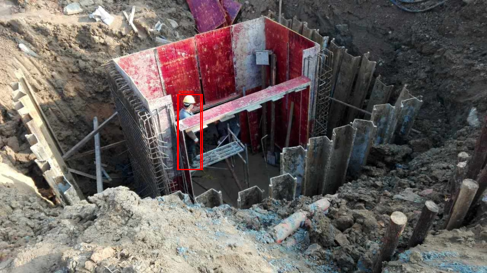
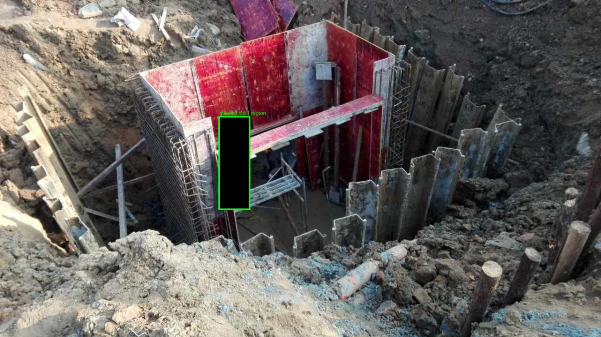

# Day 10 — Bounded Completeness Findings

163 samples classified per `technical-limitations-take-and-mitigation.md`'s bounded
definition: *"A sample passes the bounded completeness check if the model provides a
usable explanation and if perturbing the top-ranked region or top two regions causes a
measurable change in the model's answer, confidence proxy, or grounding output."*
`results/bounded_completeness.csv` (163 rows).

The headline classification is a pure rollup of Day 4's `region_extraction.csv`
(`top_region_source`) and Day 5's `descriptive_accuracy.csv`
(`answer_changed_top1`/`answer_changed_top2`) — no new model calls for that part. One
extra, explicitly bounded set of fresh calls was made: 159 top-1-only mask reruns
(reusing Day 4's already-extracted top-1 box) that additionally capture post-mask
`worker_boxes`, specifically to check the plan's flagged risk that the Day-5/9
worker-detection-fallback-rerouting artifact also contaminates completeness verdicts —
Day 5's own CSV didn't log post-mask boxes, so this couldn't be answered by rollup alone.

**Why no confidence-proxy threshold:** the definition allows "confidence proxy" as a
second measurable-change signal. Checked first: among Day 5's own
`answer_changed_top1 == False` rows, `abs(confidence_drop_top1)` has essentially the same
distribution (median 0.032, 75th pct 0.057) as the full population (median 0.032, 75th
pct 0.057) — confidence_drop carries no discriminative signal between "answer changed"
and "answer didn't change" at this scale. Adding a threshold on it would inject noise
into the classification, not real signal, so `classify_sample` uses only the categorical
answer-change signal.

## Headline numbers

| verdict | n | % |
|---|---|---|
| explanation_weak | 88 | 54.0% |
| explanation_supported | 71 | 43.6% |
| no_usable_explanation | 4 | 2.5% |

**Hard subsets** (as the plan specifically asks to report separately, not blended into the overall rate):

| subset | n | supported | weak | no_usable |
|---|---|---|---|---|
| overall | 163 | 43.6% | 54.0% | 2.5% |
| `quality_of_info == "poor info"` | 84 (51.5% of the pilot set) | 39.3% | 58.3% | 2.4% |
| multi-rule-violation | 7 | 42.9% | 57.1% | 0.0% |

Poor-info samples are mildly worse (39.3% vs 43.6% supported) but not dramatically so.
Multi-rule-violation is too small (n=7) to draw a real conclusion from — it happens to
land close to the overall rate, but with 7 samples that's not evidence of anything either
way.

## Finding 1: completeness is much weaker for PPE (rule_1) than for guardrails (rule_3) — and the mechanism is Day 4's area-based region ranking

| rule | supported | weak | no_usable | n |
|---|---|---|---|---|
| rule_1 (hard hat/vest) | 33.3% | 66.7% | 0.0% | 63 |
| rule_2 (harness/lanyard) | 46.2% | 50.0% | 3.8% | 26 |
| rule_3 (guardrail/edge barrier) | 55.1% | 38.8% | 6.1% | 49 |
| rule_4 (excavator proximity) | 44.0% | 56.0% | 0.0% | 25 |

This tracks a clean mechanistic cause, not noise. Day 4's `standardize_regions` ranks
model-returned boxes by **area**, on the stated assumption that "a larger detection is
assumed more salient than a sliver." For rule_1, the worker's whole-body box is almost
always larger than the hard-hat/vest box: the top-ranked region is the **worker** box in
48/50 (96%) of `ppe_violation`/rule_1 samples. For rule_3, the guardrail itself is often
a large structural object spanning much of the frame, so the **guardrail** is the
top-ranked region in 33/50 (66%) of `fall_hazard`/rule_3 samples — only 12/50 (24%) rank
the worker first.

Across all 163 samples, which entity got ranked top-1 predicts completeness directly:

| top-1 region is... | supported | weak | no_usable | n |
|---|---|---|---|---|
| the worker | 37.5% | 62.5% | — | 80 |
| the safety/hazard object | 49.4% | 45.8% | 4.8% | 83 |

Masking the worker is less likely to flip the answer than masking the actual safety
object. This is a real limitation of Day 4's ranking heuristic, not of the model: area is
a reasonable proxy for visual salience, but it systematically promotes the wrong entity
to top-1 exactly when the safety-relevant cue (a hard hat) is small relative to the
person wearing it — which is precisely the PPE case the pilot cares most about. Worth
flagging in Day 12 as a concrete, fixable next step (e.g. rank by "is this the rule's
queried object class" before falling back to area).

## Finding 2: the worker-detection-fallback-rerouting risk (flagged in Day 5, quantified in Day 9) also inflates a small slice of `explanation_supported`

Of the 159 model-region samples, masking the top-1 region caused the rerun to lose its
only detected worker entirely (`worker_lost_in_top1_mask=True`) in **12 cases (7.5%)**.
Of the 71 `explanation_supported` verdicts, **3 (4.2%)** co-occur with this artifact —
meaning their "supported" verdict may be driven by `_answer_presence_rule`'s scene-level
fallback branch (`"compliant" if object_boxes else "violation"`) rather than by the top
region genuinely being necessary for the rule's actual reasoning. A corrected
"genuinely-supported" count would be 68/163 (41.7%) rather than the naive 71/163 (43.6%)
— a small but real overstatement if left unflagged.

**Traced one concrete case** (`0000642`, rule_2, baseline "compliant"):

| before | after masking top-1 ("worker") |
|---|---|
|  |  |

The model's "worker" box `(436.2, 232.2, 499.8, 419.6)` and its "harness" box
`(438.6, 232.2, 495.0, 419.6)` are almost pixel-identical — Florence-2 returned nearly the
same region for both queries. Masking the top-ranked "worker" region therefore also
erases the harness evidence in the same stroke (visible in the image: the black box
swallows the only worker in frame, in the excavation). The rerun fails to redetect any
worker, triggers the fallback branch, and the answer changes — registering as
`explanation_supported`, when what actually happened is the same degenerate-fallback
mechanism Day 5 first flagged and Day 9 found under image perturbations, this time
triggered by Day 5/10's own masking procedure rather than noise.

## Finding 3: grid-fallback (`no_usable_explanation`) is rare overall but concentrated in rule_3

Only 4/163 samples (2.5%) had no native grounding box at all:

| image_id | primary_class | rule | quality_of_info |
|---|---|---|---|
| `0000253` | fall_hazard | rule_3 | rich info |
| `0000361` | fall_hazard | rule_3 | poor info |
| `0000620` | compliant | rule_2 | rich info |
| `0001229` | fall_hazard | rule_3 | poor info |

3 of the 4 are rule_3. "Guardrail" / "edge protection barrier" is a harder
open-vocabulary detection target for Florence-2 than "hard hat" or "worker" — consistent
with rule_3 already showing the lowest grounding hit-rate signal back in Day 3/4. The
rate is small enough that it doesn't change the headline number much, but the
concentration is consistent, not random.

## Verification performed

- `pytest tests/test_metrics_completeness.py -v` — 4/4 passed (pure classification logic, synthetic inputs, no GPU); full suite `pytest tests/ -v` — 61/61 passed.
- `scripts/10_bounded_completeness.py` ran end-to-end, exit code 0, wrote 163 rows to `bounded_completeness.csv`.
- Cross-checked the confidence-drop-carries-no-signal claim directly against `descriptive_accuracy.csv` before writing it into `completeness.py`'s docstring, rather than assuming a threshold and tuning it post hoc.
- Visually confirmed the `0000642` fallback-artifact trace above by reading the saved before/after images, not just trusting the aggregate `worker_lost_in_top1_mask` overlap count.
- Cross-checked the "top-1 region is the worker" mechanism against `region_extraction.csv`'s `top_region_label` and `baseline_predictions.csv`'s `worker_boxes`/`object_boxes` columns directly (not assumed) before writing Finding 1.
