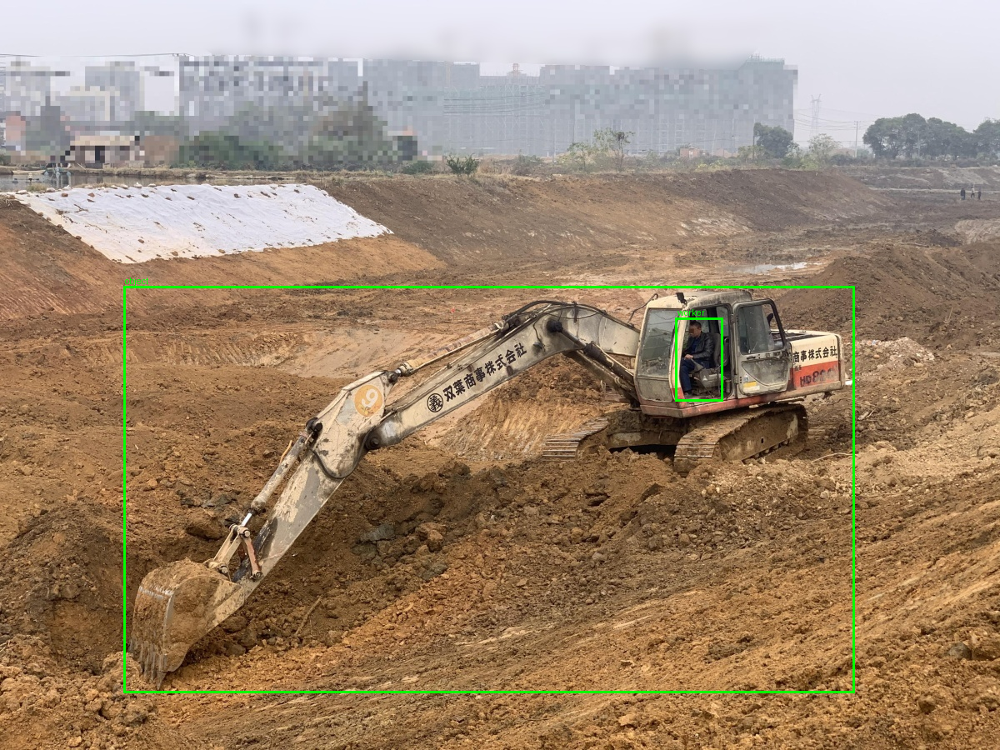
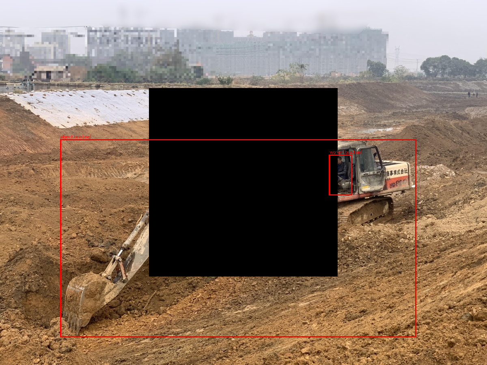
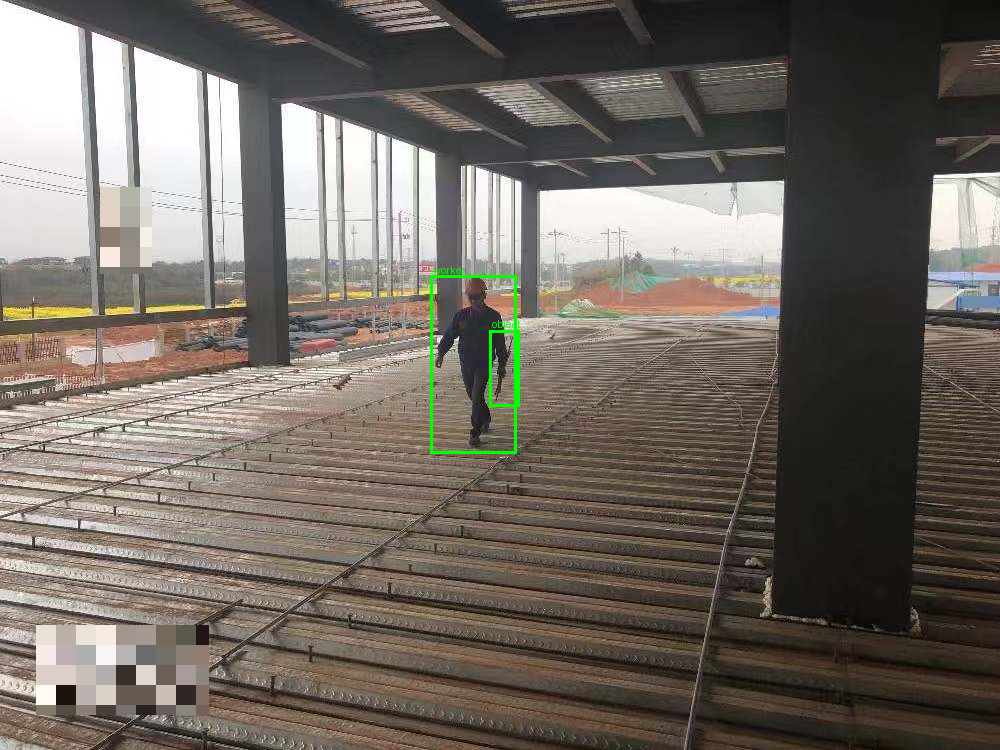
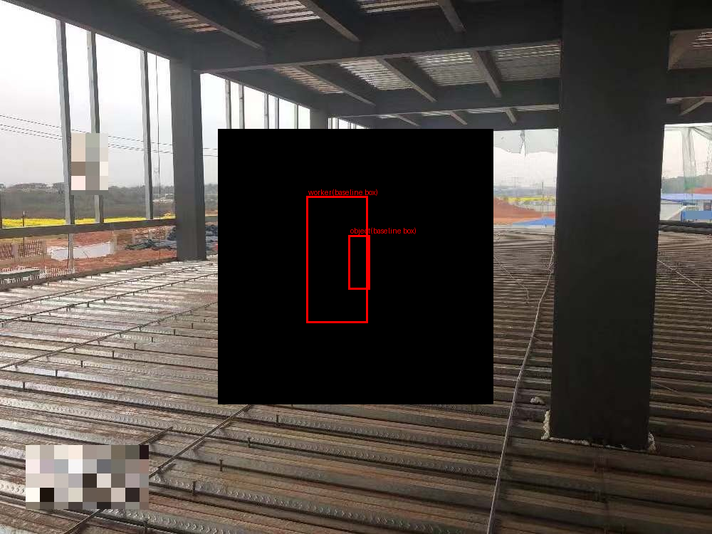
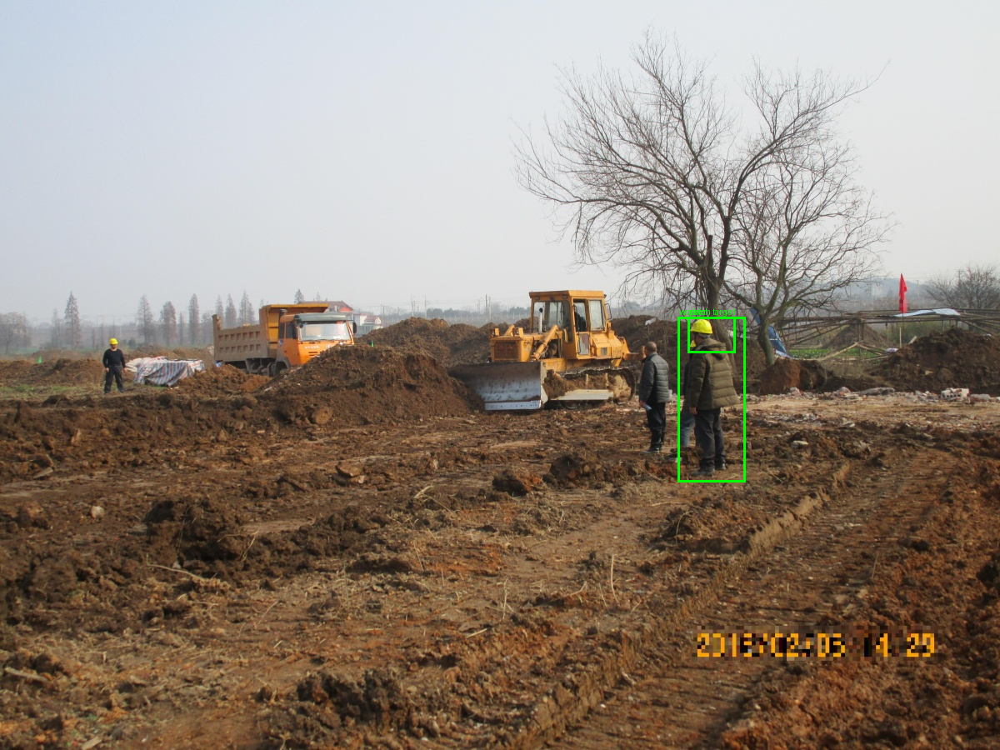
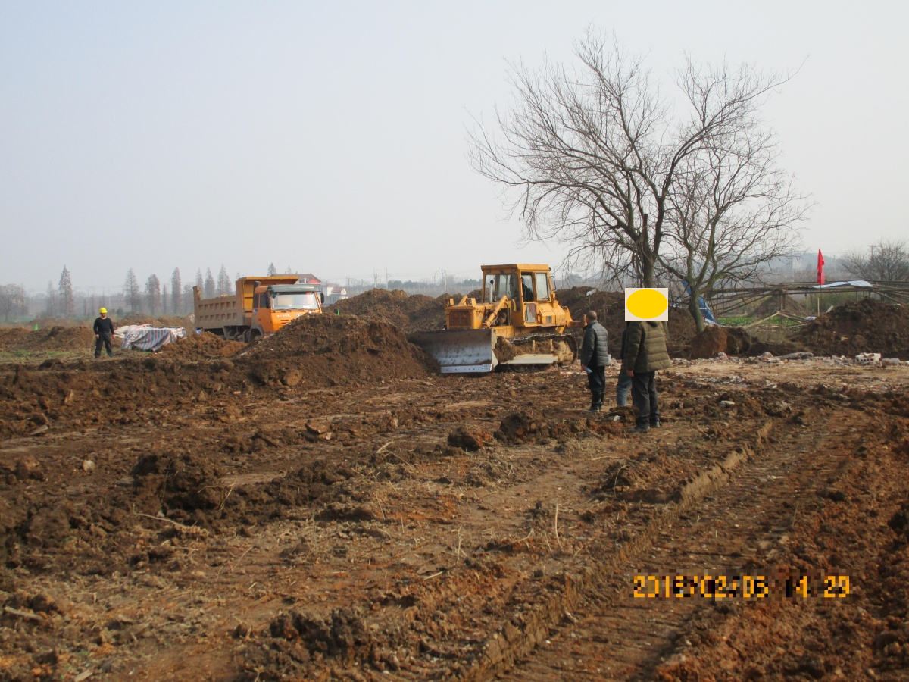
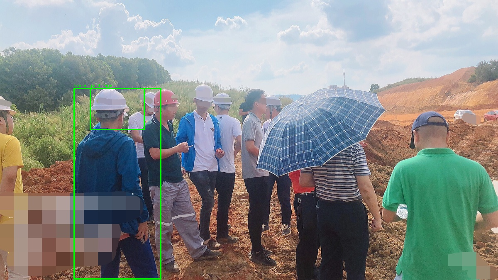
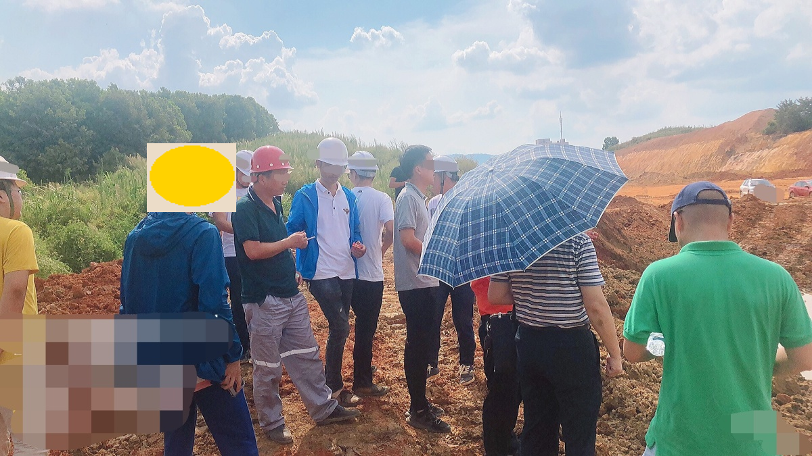

# Day 9 — Robustness Findings

163 samples × 4 Level-1 image perturbations (652 reruns) + Level-2 reworded-prompt
reruns (138 of 163 — rule_4 has no second phrasing, see below) + a 20-sample
synthetic-hard-hat-patch stretch test. All reruns use the same deterministic
decoding as the logged baseline (`num_beams=3`, no sampling) so perturbation
sensitivity isn't confounded with Day 7's sampling-noise sensitivity.
`results/robustness.csv` (815 rows), `results/robustness_patch_stretch.csv` (20 rows).

## Headline numbers

**answer_changed rate by perturbation:**

| perturbation | answer_changed | worker_lost | mean confidence_drop | mean object_box_iou |
|---|---|---|---|---|
| occlude | 28.2% | 8.6% | -0.012 (confidence rose) | 0.530 |
| reworded_prompt | 27.5% | 0.0% | -0.053 (confidence rose) | 0.333 |
| blur | 27.0% | 0.0% | 0.013 | 0.287 |
| low_light | 11.7% | 0.6% | 0.011 | 0.816 |
| contrast_shift | 10.4% | 0.0% | 0.008 | 0.825 |

Brightness/contrast changes are the mildest perturbation (boxes barely move,
answers rarely flip); blur, occlusion, and prompt rewording are all
substantially more disruptive, but — as the findings below show — for three
different reasons, not one.

rule_4 is excluded from Level 2 (logged with `excluded_reason =
"rule_4_has_no_second_phrasing"`, not scored as 0% change): `answer_rule`
routes rule_4 to `_answer_rule_4`, which has no `phrasing_index` parameter at
all, so passing `phrasing_index=1` for rule_4 would have silently been a
no-op rerun of the exact same query — not a real test of wording sensitivity.
Caught before writing any aggregation code.

## Finding 1: occlude's instability is partly the Day-5-flagged fallback artifact, not genuine sensitivity

Of occlude's 46 answer-flip cases, 9 (20%) are also `worker_lost=True` —
i.e. the rerun's fresh detection on the occluded image found no worker at
all, routing `_answer_presence_rule` into its scene-level fallback branch
(`"compliant" if object_boxes else "violation"`) for reasons disconnected
from whether the *safety object* was actually still visible. `worker_lost`
rate is also far from uniform across rules: rule_2 (19.2%) >> rule_4 (16.0%)
> rule_3 (8.2%) >> rule_1 (1.6%) for the same occlude perturbation — rule_2's
samples appear to disproportionately frame a single, fairly centered worker,
making a centered-square occlusion more likely to wipe out the only
detection.

**Traced one concrete case** (`0000341`, rule_3, baseline "compliant"):

| | before | after occlude |
|---|---|---|
|  | the "worker" box is actually a false-positive on the excavator's cab window; the "object"(guardrail-query) box is the entire excavator silhouette — both baseline boxes were already wrong, they just happened to geometrically satisfy the coverage check |  |

After occlusion, *both* detections vanish (`worker_lost=True`,
`object_box_iou=NaN`) even though the occluded square doesn't fully cover
either original box — occlusion disrupts Florence-2's whole-scene grounding
context, not just the literal pixels under the black square. The fallback
then defaults to "violation" purely because no object box survived,
flipping `answer_changed=True`. This reads, in an aggregate table, identical
to "the model correctly noticed the safety equipment became occluded" — it
isn't; it's the same degenerate-fallback mechanism Day 5 already flagged,
just triggered by a perturbation instead of a deliberate mask. **Implication
for Day 10:** Bounded Completeness must apply the same `worker_lost` check,
not just report `no_usable_explanation` rates blindly.

## Finding 2: a stable answer can hide a fully-drifted explanation

Quantified across all 611 stable-answer rows that have a comparable object
box on both sides: **28.3% have `object_box_iou < 0.3`** — the answer didn't
change, but the box the model is pointing to moved to something essentially
unrelated. This is wildly uneven by perturbation:

| perturbation | % of stable answers with iou < 0.3 |
|---|---|
| blur | 58.8% |
| reworded_prompt | 56.7% |
| occlude | 32.4% |
| low_light | 5.7% |
| contrast_shift | 2.8% |

**Traced one concrete case** (`0000034`, rule_2, baseline "compliant",
`answer_changed=False`):

| before | after occlude |
|---|---|
|  |  |

The worker's entire baseline box sits inside the occluded square, yet the
rerun still reports `worker_lost=False` (it found *a* worker box somewhere)
and the final answer is unchanged — while `object_box_iou=0.005`, i.e. the
object box moved to a near-completely different location. **An
answer-level robustness number alone would call this sample perfectly
robust; it isn't, at the explanation level.** This directly motivates why
Day 11's rollup must report explanation-level (box) and answer-level
robustness as two separate numbers, not one blended score — mirroring the
visual/text-sparsity separation already established in Day 6.

## Finding 3: rule_2's two phrasings aren't just synonyms — Level 2 answer-change rate by rule

| rule | reworded_prompt answer_changed |
|---|---|
| rule_2 (harness / lanyard) | 50.0% |
| rule_1 (hard hat / hi-vis vest) | 31.7% |
| rule_3 (guardrail / edge barrier) | 10.2% |

rule_3's two phrasings ("guardrail" vs. "edge protection barrier") are
near-synonymous and Florence-2 grounds them consistently. rule_2's
("safety harness" vs. "fall-protection lanyard") are not really synonyms —
a harness is a body garment, a lanyard is the tether attached to it — so
the two queries can legitimately ground different physical objects in the
same scene, not just the same object under different wording. This is a
prompt-design caveat for Day 11/12, not a model robustness failure: rule_2's
two "phrasings" should probably be treated as two distinct concepts rather
than wording variants of one concept in any future revision of `prompts.py`.

## Finding 4: confidence rises, not falls, under occlude and reworded_prompt

Mean `confidence_drop` is *negative* for occlude (-0.012) and
reworded_prompt (-0.053) — average confidence went up after the
perturbation, despite both having among the highest answer-change rates.
Consistent with the general caution already carried from Day 3/5: this
"confidence" is a mean token-generation-probability proxy, not a calibrated
correctness signal — removing visual clutter or changing the query can make
the model surer of a *different, not necessarily more correct*, detection.

## Stretch: synthetic hard-hat patch (20 ppe_violation/rule_1 candidates)

**Caught a vacuous-denominator issue before reporting the headline number.**
16 of the 20 candidates (all dataset-labeled `ppe_violation`) already had a
baseline *proxy* answer of "compliant" — a known sensitivity gap in the
grounding-proxy method, not something this test is about — so "fooling"
isn't a meaningful concept for them; reporting the naive 15% (3/20) flip
rate would silently dilute the real signal with samples where flipping was
already the status quo. Restricting to the 4 candidates the proxy already
called "violation" (the only ones where a flip means anything):
**3/4 (75%) flipped to "compliant" after the patch.** `09_robustness_test.py`
now prints both numbers explicitly.

n=4 is too small to generalize beyond "plausible, worth a larger run" — and
the 4 traced cases don't show a clean placement → flip correlation, which
matters for how confidently this gets reported in Day 12:

| image | patch placement | flipped? |
|---|---|---|
| `0000233` | off-target (torso/shoulder, not head — crude `_head_box` approximation, no pose estimation) | ✅ flipped |
| `0000641` | on-target (squarely on the head) | ❌ did not flip |
| `0001431` | on-target | ✅ flipped |
| `0001842` | on-target, scene already has many real hard-hat wearers | ✅ flipped |

A well-placed patch (`0000641`) failed to fool the model while an
off-target one (`0000233`) succeeded — the flip doesn't cleanly track
anatomically correct placement, suggesting Florence-2's "hard hat" grounding
is generally imprecise about *where* on a person the cue needs to be, in
both directions (sometimes too lenient, sometimes not lenient enough). This
is exactly the kind of result `technical-limitations-take-and-mitigation.md`
anticipated for a "Level 3 should be a small part, not a full promise"
stretch task — real signal, explicitly not strong enough to claim a
demonstrated real-world spoofing vulnerability from n=4.

## Verification performed

- `pytest tests/test_perturbations.py tests/test_metrics_robustness.py -v` — 15/15 passed (pure image-transform and pure robustness-comparison logic, synthetic inputs, no GPU).
- `scripts/09_robustness_test.py` ran end-to-end, exit code 0, wrote 815 + 20 rows.
- Visually confirmed 6 traced cases above (2 occlude mechanism cases, 4 patch-stretch cases) by reading the saved before/after images directly, not just trusting the aggregate numbers.
- Fixed the patch-stretch script's summary line (`09_robustness_test.py`) to report both the naive and the denominator-corrected flip rate, after catching the vacuous-denominator issue from the raw CSV — no rerun needed since the underlying model outputs were already correct, only the presentation was wrong.
