# Executive Overview {.unnumbered}

This briefing evaluates whether an established six-metric XAI methodology, originally validated on tabular network-intrusion-detection models, transfers to a vision-language model operating on construction-site photographs. The pilot uses Florence-2-base-ft, 163 images from the ConstructionSite test split, and an eleven-stage evaluation pipeline. The scale-up work then tests and corrects the principal validity threats identified by the pilot.

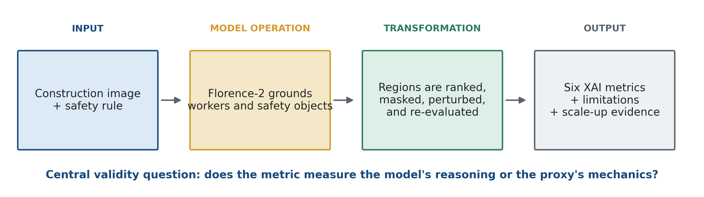{width=100%}

## Principal Findings {.unnumbered}

- **The six-metric structure transfers, but the image domain introduces measurable confounds.** All six metrics ran end to end, yet region size, ranking policy, worker-detection loss, and the grounding proxy affected how several results should be interpreted.
- **The initial scene-level proxy was not adequate.** Its 3.0% sensitivity improved to 27.0% after the safety check became person-relative, a ninefold increase.
- **The pilot's largest shared confound was region ranking.** Area ranking selected the worker body instead of the safety object in 50.3% of usable samples. Rule-aware ranking reduced this to 0.6%.
- **Answer stability does not guarantee explanation stability.** The pilot detected stable answers with shifted evidence regions, although later size controls showed that the original IoU-based magnitude was partly overstated.
- **The deepest limitation remains the source of the final verdict.** Florence-2 detects objects, while hand-written geometric logic determines compliance. The full study must distinguish model faithfulness from proxy sensitivity.
- **Scale-up Phases 1 and 2 are complete; Phase 3 is in progress.** Attribution and expanded model/dataset work remain gated on the decisions summarized in Section 7.

## Document Structure {.unnumbered}

| Section | Focus |
|---|---|
| 1-2 | Research problem and image-domain operationalization of the six metrics |
| 3-4 | Pipeline architecture, dataset, model, and reusable components |
| 5 | Stage-by-stage pilot transformations, outputs, limitations, and corrections |
| 6 | Completed scale-up work, current status, and remaining phases |
| 7 | Scientific decisions requiring advisor sign-off |

---

# Part A: Feasibility Pilot {.unnumbered}

# Research Objective and Problem Statement

## Study Objective

This study examines whether an established six-metric XAI evaluation methodology transfers from **tabular network-intrusion detection** to a **vision-language model (VLM)** operating on construction-site photographs. The metric structure is preserved while the image-specific operational details are evaluated empirically. The central question is whether each metric retains its intended meaning and, where it does not, which minimum adaptation restores construct validity.

## Evaluation Methodology

Explainable-AI work needs a principled way to decide whether a model's explanation can be trusted. This methodology grades an explanation along six axes:

1. **Descriptive Accuracy** - is the region the model points to actually the reason for its answer?
2. **Sparsity** - is the explanation focused on a few things, or smeared everywhere?
3. **Stability** - if we run the model again, do we get the same explanation?
4. **Robustness** - does the explanation survive small changes to the input?
5. **Bounded Completeness** - does the explanation contain *all* the evidence that matters, not just some?
6. **Efficiency** - is measuring all of this cheap enough to run at scale?

Together, the six properties provide a general framework for evaluating explanations. In the original **tabular network-intrusion-detection** setting, each input feature is a scalar column, such as `failed_login_count = 42` or `bytes_sent = 900000`, and an explanation is represented as a set of feature weights.

## Domain Shift from Tabular Models to VLMs

A construction-safety VLM is not tabular at all. The input is an **image plus a text prompt**. The explanation is not a feature weight - it is a **spatial region**, a box drawn on the image. So the same word, "explanation," now means something physically different.

A quick side-by-side makes the gap concrete:

| | Tabular IDS model (where the methodology came from) | Construction-safety VLM (where we take it) |
|---|---|---|
| Input | a row of numbers | an image + a text prompt |
| A "feature" | one column, e.g. `failed_login_count` | a region of pixels, e.g. a box around a hard hat |
| An "explanation" | feature weights (80% this column) | a bounding box on the image |
| "Masking a feature" | set a column to zero / its mean | paint over a region of the image |

Because the pieces are different, we cannot assume the metrics carry over untouched. "Mask the important feature and see if the answer changes" is clean for a column of numbers. For an image it raises new questions: *which* region do we mask, how do we mask it, and does painting over a box break the model for reasons that have nothing to do with safety? Each of the six metrics has a version of this problem.

## Methodological Scope

The study **retains the six-metric structure** and adapts only the image-specific operational procedures.

- **Invariant methodological structure.** The six axes, their names, and their intended claims remain unchanged. No metric is added, removed, or conceptually redefined.
- **Image-domain operationalization.** The computation of each metric is adapted where a tabular operation has no literal image equivalent. For example, masking a tabular feature can mean setting a scalar to zero, whereas masking an image requires a region-selection policy, a mask transformation, and a check for unrelated detector failure.

Two adaptations were needed just to run the methodology on this VLM at all - and both are about *how we get the model to answer a safety question*, not about the metrics themselves (detailed in §2 and §5). Inside the metrics, only the concrete technique under two of the six axes had to be swapped for an image-appropriate equivalent - for example, Sparsity could not use the planned attention-rollout and uses cross-attention instead. The meaning of each metric is untouched. So the honest headline is: **the methodology transfers - with a small number of well-defined changes, not zero and not a redesign.**

## Research Significance

Construction sites are high-stakes. If a model looks at a photo and says "compliant - everyone is wearing a hard hat," a safety officer needs to trust not just the *answer* but the *reason*. A model can be right for the wrong reason: it might say "compliant" while actually looking at the sky, or at a parked truck. These six metrics are exactly the tools that catch this. But they were only ever validated on tables. Before anyone builds a safety product on top of a VLM, someone has to check that the evaluation itself holds up in the image world. That is what this project does.

## Research Question

> Does the **structure** of the six-metric XAI evaluation methodology remain valid when transferred from tabular models to a vision-language model, and what **minimum adaptations** are required to preserve the intended meaning of each metric?

Note what we are *not* asking. We are not asking "is Florence-2 a good safety model?" We are asking "does the *evaluation methodology* still measure what it claims to measure when the model is a VLM?" The model under test is a means to that end.

## Pilot Scope and Success Criteria

A full study on thousands of images is expensive and slow to change course. A **feasibility pilot** is the right first instrument: run all six metrics end-to-end on a small, balanced set of images, and let the methodology tell us - cheaply - where it breaks. "Done" for the pilot does not mean "final safety numbers." It means:

- all six metrics ran end-to-end and produced real, interpretable signal (not crashes, not constant outputs), **and**
- we have a clear, evidence-backed list of exactly what must be fixed before the numbers can be trusted at scale.

The pilot satisfied both criteria. It evaluated **163 images** from the ConstructionSite test split using **Florence-2-base-ft** on a single consumer GPU. The remainder of Part A documents the methodology, implementation, and stage-level evidence.

---

# Proposed Methodology

## Methodological Overview

This section is the *design* of the study - the approach, before any code runs. It has two parts. First, a strategy to make a safety question answerable by a model that cannot answer questions. Second, a concrete way to run each of the six metrics on top of that strategy. (What actually happened when we ran it is §5.)

## Safety Judgment as a Grounding Task

Florence-2 does not accept unrestricted yes-or-no safety questions. It instead supports **grounding**: a short phrase such as `"hard hat"` produces bounding boxes around detected instances of the requested object.

So we reframe each safety rule as a set of **detection queries**, and then compute the safety answer ourselves from the geometry of the returned boxes. For a PPE rule:

1. Ask the model to detect `"worker"` → it returns worker boxes.
2. Ask it to detect `"hard hat"` → it returns hard-hat boxes.
3. Apply a rule in code: the scene is **compliant** only if *every* detected worker has a hard hat near their head; otherwise it is a **violation**.

This combination of object detection and geometric evaluation is termed the **grounding proxy**. The distinction is methodologically important: the **model localizes objects**, whereas hand-written geometric logic produces the compliant-or-violation judgment. Sections 5-7 evaluate the consequences of this division.

**Proxy correction.** The initial geometric rule used a scene-level existence check: "is there any hard hat anywhere in the image?" In multi-worker scenes, the presence of at least one hard hat caused the proxy to return "compliant" even when another worker was unprotected. The proxy was therefore redesigned as a **person-relative** check that evaluates coverage for each detected worker, consistent with the dataset's annotation logic. Section 5 reports the measured effect of this correction.

## Operationalization of the Six Metrics

With the grounding proxy in place, each metric turns into a concrete test on images:

1. **Descriptive Accuracy** - *is the region really the reason?* Take the region the model used, **paint over it, re-run, and check whether the answer flips.** If masking the region flips the judgment, the region was genuinely load-bearing.
2. **Sparsity** - *is the attention focused?* Read the model's internal attention over the image and measure how concentrated it is - a few hot cells, or smeared across the frame. (Technique note: the originally planned *attention-rollout* method assumes a single-modality encoder; Florence-2 mixes image and text tokens in one shared attention stack, so rollout does not apply. We use **decoder→encoder cross-attention** instead. This is one of the two in-metric technique swaps from §1.)
3. **Stability** - *same explanation on a re-run?* If we re-ran the model deterministically, it would trivially give the identical answer every time - a meaningless 100%. So we run it several times **with a little randomness** (sampled decoding) and measure how much the answer and the region move.
4. **Robustness** - *does it survive small input changes?* Apply mild perturbations - blur, low light, a small occlusion, contrast change - and also **reword the prompt**, then check whether the answer and the region hold up.
5. **Bounded Completeness** - *is all the key evidence in that one region?* A necessity test: **remove the top region and see whether the model is forced to change its answer.** If it is, that region really was carrying the decision.
6. **Efficiency** - *is this cheap enough at scale?* Time each stage on the GPU and project the cost out to 1,000+ images, so we know whether the bottleneck to a full study is compute or something else.

## Key Design Constraints

Two decisions in this design come back repeatedly later, so we name them here:

- **The proxy can contaminate the metrics.** Because a geometric rule - not the model - makes the final call, some metrics may end up measuring *the proxy's* sensitivity rather than *the model's reasoning*. This is the deepest issue in the whole pilot, and the main reason the scale-up adds a model that answers directly (Part B).
- **Top-region selection is not model-defined.** Metrics 1, 3, and 5 require a region to mask or track, but Florence-2 does not supply an importance score. The pilot therefore ranked candidate boxes by **area**. Subsequent analysis identified this policy as the most consequential shared confound (Section 5).

## Methodological Output

The output of this section is a concrete, runnable recipe: **one grounding-proxy task setup + six image-adapted metric tests**, plus two design choices (the proxy, and area-ranking) that we deliberately flag as things to watch. §3 turns this recipe into an actual pipeline; §4 describes the parts it is built from; §5 walks through running it and what each stage produced.

---

# Implementation Plan and Architecture

## System Overview

This section turns the §2 recipe into an actual running system. The pipeline is **11 numbered stages, run in order**. Each stage is a small script that reads the previous stage's output file, does one job, and writes its own output file. This section shows the whole thing on one flowchart, then names every component so §4 can open each one up.

## Eleven-Stage Evaluation Pipeline

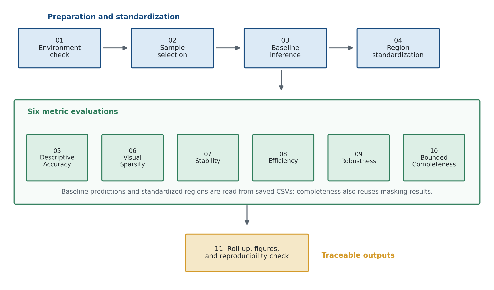{width=100%}

The operational sequence has four parts:

- **Environment validation (01)** confirms GPU availability and pinned dependencies before model execution.
- **Preparation and standardization (02-04)** select a reproducible sample, generate baseline predictions and boxes, and convert the boxes into ranked, maskable regions.
- **Metric evaluation (05-10)** applies the six XAI tests. Descriptive Accuracy, Stability, and Robustness use the baseline predictions; Sparsity, Efficiency, and Bounded Completeness use the standardized regions. Bounded Completeness also reuses Descriptive-Accuracy masking results and is therefore not an independent confirmation.
- **Synthesis (11)** reads the six result files and produces the cross-metric tables and figures.

**Artifact traceability.** Every stage writes a CSV file that the next stage reads. No result is passed only in memory. This design permits stage-specific inspection and re-execution, and it provides a direct path from each reported number to its source artifact. The same structure later exposed a hardcoded figure-label bug during the clean reproducibility run described in Section 5.

## Layered Architecture

The eleven scripts are deliberately thin: each reads an artifact, calls the shared library, and writes the next artifact. Reusable logic remains in `src/xai_pilot/`, while run-level choices remain in `config.py`.

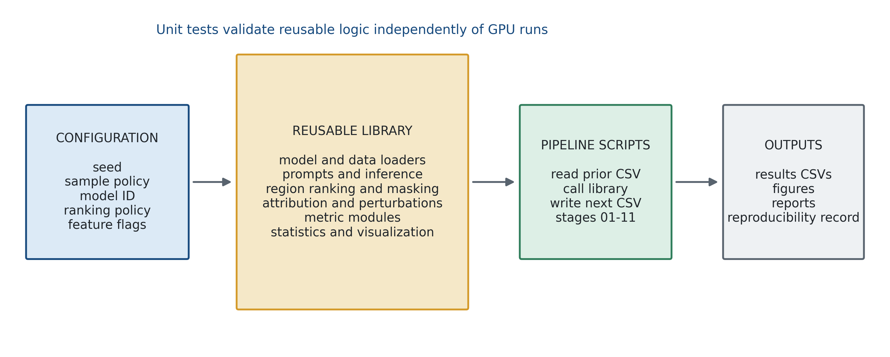{width=100%}

The three-layer split is a standard, deliberate engineering choice:

- **Config layer** - one file (`config.py`) holds everything that could change: the random seed, how many images per class, the model ID, the region-ranking policy, and on/off feature flags. Nothing is hardcoded deep inside a script. Change a run by changing config, not by editing ten files.
- **Library layer** - the reusable building blocks (load the model, run inference, rank regions, compute cross-attention, perturb an image, each metric). Because this logic is separated out, it can be **unit-tested in isolation** (the `tests/` folder), independently of the slow GPU pipeline.
- **Pipeline layer** - the 11 scripts that string the library together in order, each writing its CSV.

## Implementation Outcome

The output of this section is a working, inspectable 11-stage pipeline that runs end-to-end on a single consumer GPU - from the raw dataset all the way to a cross-metric summary - with every intermediate result saved to disk and every piece of reusable logic covered by unit tests. §4 now opens up the most important boxes in these diagrams one at a time: the dataset, the model, and the supporting pieces.

---

# Dataset, Model, and Supporting Components

## Component Overview

§3 showed the pipeline as boxes and arrows. This section opens the most important boxes and shows what is actually inside them, with concrete examples - the dataset, the model, and the supporting library pieces that make the grounding-proxy strategy from §2 work.

## ConstructionSite Dataset

**Dataset composition.** `ConstructionSite` is a public dataset on Hugging Face (`LouisChen15/ConstructionSite`) containing real construction-site photographs with human-annotated safety violations. It contains **10,013 images**, including a **3,004-image test split** reserved for evaluation. The pilot draws exclusively from this test split.

**Local representation.** The **entire dataset** (train and test splits, approximately 4.4 GB) is stored locally as Parquet files in `pilot/data/constructionsite/`. The pipeline prioritizes this local copy over network streaming, preventing data transfer from becoming the scale-up bottleneck.

**Annotation schema.** Every image carries up to four annotation fields, one per safety rule:

| Rule | Hazard class | What it checks |
|---|---|---|
| `rule_1` | `ppe_violation` | Basic PPE present - hard hat / hi-vis vest |
| `rule_2` | `fall_hazard` | Fall protection (harness / lanyard) at height |
| `rule_3` | `fall_hazard` | Edge protection (guardrail) at height / excavation edges |
| `rule_4` | `struck_by_risk` | Worker inside an excavator's blind spot / swing radius |
| *(none violated)* | `compliant` | Every applicable rule satisfied |

A field is present when the image shows that violation. An image can, in principle, violate more than one rule at once (a worker with no hard hat *and* standing near an unprotected edge) - this "multi-hazard" case matters later (§6, §7).

**Example.** An image annotated `rule_1_violation` shows one or more workers **without** a hard hat or vest. An image with no violation fields at all is `compliant`.

**Pilot subset.** The pilot uses a **163-image subset**: 50 images each for `ppe_violation`, `fall_hazard`, and `compliant`, together with all **13** `struck_by_risk` images available under the pilot's mutually exclusive test-split labeling policy. A fixed random seed (`SEED = 42`) reproduces the same selection. Section 5 explains the class shortfall, and Section 6 documents the multi-label correction.

## Mapping Safety Classes to Florence-2 Operations

§2 already introduced the general strategy - reframe a safety rule as a grounding query, then let a geometric rule turn the returned boxes into a verdict - because Florence-2 has no yes/no question mode. Here is exactly how that strategy maps onto these four specific classes:

| Class / rule | What we ask Florence-2 to find | How the verdict is computed |
|---|---|---|
| `ppe_violation` (rule_1) | `"worker"` and `"hard hat"` (and `"high-visibility vest"`) | violation if any detected worker has no nearby hard hat / vest box |
| `fall_hazard` (rule_2) | `"worker"` and `"safety harness"` / `"fall-protection lanyard"` | violation if any detected worker at height has no nearby harness/lanyard box |
| `fall_hazard` (rule_3) | `"worker"` and `"guardrail"` / `"edge protection barrier"` | violation if any detected worker near an edge has no nearby guardrail box |
| `struck_by_risk` (rule_4) | `"worker"` and `"excavator"`, independently | violation if a worker box falls inside the excavator's proximity/blind-spot radius |
| `compliant` | (whichever rule the image gets tested against - see Stage 02 below) | no violation detected by the above checks |

Every row uses the same underlying pattern: **detect, don't ask.** Florence-2 never sees the word "hazard" or "compliant" - it only ever returns boxes for a phrase. The four rows above are four instances of one mechanism, not four different techniques.

## Florence-2-base-ft

**Model selection.** Florence-2-base-ft (Microsoft) is a **231-million-parameter** vision-language model that runs on the pilot's 8 GB RTX 3070. It was selected because it is lightweight, openly licensed (MIT), ungated, and suitable for rapid iterative evaluation.

**Functional constraint.** Florence-2 does not provide unrestricted visual question answering. Instead, it supports a fixed set of **task tokens**. This study uses `<OPEN_VOCABULARY_DETECTION>`, which accepts a short phrase and returns bounding boxes for detected instances of that phrase. For example:

```
input: <OPEN_VOCABULARY_DETECTION>hard hat
output: [box around hard hat #1, box around hard hat #2, ...]
```

There is no task token that means "answer this yes/no question." That is the limitation §2 described, made concrete: the model can *point at things*, but it cannot *judge* them. The geometric-rule step described in §2 is what converts a list of boxes into a compliant/violation verdict.

**Precision note.** The model runs in **fp16** (half precision) for speed and memory. This is fine for the forward-pass metrics used in the pilot, but it matters later: gradient-based attribution methods (a possible scale-up addition, §7) can lose precision in fp16 and need fp32 or bf16 instead.

## Supporting Library Components

These are the reusable building blocks named in §3's architecture diagram. Each is a small, independently testable piece of logic.

**`prompts.py` - the rule-to-query dictionary.** This is the single source of truth for *what phrase to ground for each rule*. For example, `rule_1` grounds `"hard hat"`; `rule_4` is a **proximity** rule, so instead of one phrase it grounds two - `"worker"` and `"excavator"` - independently, then checks whether their boxes are close enough to count as a hazard. This module also encodes something we adopt carefully: a rule's phrasings are only ever swapped with a true **synonym** of the same physical object (e.g. "guardrail" and "edge protection barrier"), never with a different object (a harness is not a lanyard) - this distinction turned out to matter (§5, §7).

**`regions.py` - turning raw boxes into a ranked, maskable list.** Florence-2 returns boxes with no built-in "importance" score. This module standardizes them into an ordered list of **candidate regions**, using a chosen ranking policy (in the pilot: biggest box first - the area-ranking design choice flagged in §2), and provides the masking primitive Descriptive Accuracy and Bounded Completeness both use: paint over a given region and hand back a valid image for re-inference.

**`attribution.py` - where did the model look?** Florence-2's internal encoder processes the image as **576 patches arranged in a 24×24 grid** (that number comes directly from the model's own architecture: a 768×768 input image, reduced through four convolution stages, always yields 576 patches). This module reads the model's **cross-attention** - literally, how much weight the model's answer-generation step put on each of those 576 patches - and turns it into a heatmap. This is the concrete mechanism behind the Sparsity metric from §2.

**`perturbations.py` - controlled image changes for the Robustness metric.** Four operations, each with a plain visual meaning: **blur** (Gaussian blur, simulating a soft-focus camera), **low light** (gamma-darkening, simulating dusk or shadow), **occlusion** (paint over part of the image, simulating something blocking the camera), and **contrast** change. Each is a small, self-contained, testable function - apply it, re-run the model, compare.

**`metrics/` - one module per metric.** A direct 1-to-1 mapping to the six axes from §2: `descriptive_accuracy.py`, `sparsity.py`, `stability.py`, `robustness.py`, `completeness.py`, `efficiency.py`. Each contains the actual scoring logic for its metric, kept separate from the orchestration scripts in §3 so it can be unit-tested without a GPU.

## Integrated Example

A worked example ties the pieces together. For one image labeled `rule_1_violation`: `prompts.py` supplies the query `"hard hat"` → the **model** (4.2) grounds it and returns a box → `regions.py` ranks it among the candidate regions → `attribution.py` can show the cross-attention heatmap behind that box → `perturbations.py` can blur or occlude the image and we re-run to test Robustness → `metrics/descriptive_accuracy.py` can mask the box and check whether the verdict flips. Every one of these pieces, and how they behaved when actually run on the 163-image set, is the subject of §5.

---

# Pilot Pipeline: Transformations, Outputs, and Limitations

## Evaluation Protocol

This section reports the complete pilot in execution order. Each stage identifies the **input**, the **transformation**, the resulting **output**, and the relevant **validity assessment**. Corrections are reported with their measured effects so that methodological adaptations remain distinct from post hoc interpretation.

| Stage group | Primary input | Transformation | Principal output |
|---|---|---|---|
| Environment and sampling (01-02) | Software environment and ConstructionSite test split | Dependency validation and seeded class selection | Reproducible 163-image pilot manifest |
| Baseline and region construction (03-04) | Pilot images and rule-specific prompts | Open-vocabulary grounding, geometric judgment, and region ranking | Baseline verdicts and ranked candidate regions |
| Explanation evaluation (05-10) | Baseline verdicts, regions, and attention | Masking, attribution, repeated inference, perturbation, and timing | Six metric-specific result files and diagnostic figures |
| Synthesis (11) | Metric-specific outputs | Cross-metric aggregation and clean-environment reproduction | Summary tables, figures, and reproducibility evidence |

## Stage 01: Environment Check

**Input and transformation.** The stage validates GPU visibility and confirms the pinned package versions before model inference.

**Result and compatibility correction.** The GPU was detected at `cuda:0`, with fp16 inference enabled. Florence-2 attempted to import `flash_attn`, for which no working Windows build was available. The import check was intercepted and the model was explicitly routed through PyTorch's built-in `sdpa` attention implementation. This correction changes platform compatibility, not the underlying model computation or reported scientific results.

## Stage 02: Sample Selection

**Input and transformation.** A fixed-seed sampler draws a target number of test-split images per analysis class, producing a reproducible evaluation manifest.

**Result.** The target was 50 images across four classes (200 total). The actual sample contained **163 images**: three classes reached 50, whereas `struck_by_risk` contained only **13**.

**Limitation and verification.** A direct scan of the full 3,004-image test split confirmed that the shortfall was not a sampler defect. The count of 13 arises specifically when each image is forced into one mutually exclusive class. Multi-hazard images assigned to a higher-priority PPE class consequently lose their struck-by contribution. This restriction belongs to the pilot's labeling policy rather than to the underlying dataset.

**Dataset-scope analysis.** The completed Phase 1.2 analysis established the following:

- Scanning the same 3,004-image test split but letting an image count toward **every** class it violates (instead of just one) recovers the pool from 13 to **24** - the other 11 were real struck-by hazards that were simply filed elsewhere.
- Reaching a full 50 requires also pulling from the roughly 7,000-image **train** split (10,013 total - 3,004 test = ~7,009 train images) that the pilot deliberately never touched, precisely so no evaluation image had been seen during any fine-tuning. Phase 1.2 of the scale-up built the multi-label sampler that makes this possible; the actual train-split supplement and the full downstream scale run are still future execution, not completed results (§6).
- The limitation is therefore not an absolute absence of images. It is a shortage **under the one-class-per-image policy within the held-out test split**. The sampler now addresses the first restriction; train-split supplementation remains a proposed scale-run procedure.

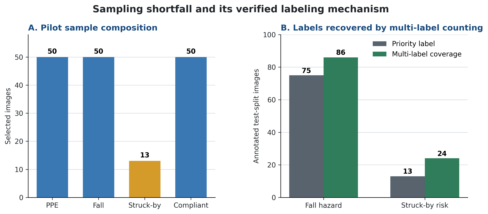{width=100%}

**Compliant-sample assignment.** Compliant images have no violated rule that can determine a natural test assignment. The pilot therefore distributes them evenly across the four rules by round-robin assignment. For example, a worker standing on level ground may be assigned to `rule_2` even though no elevated-work context is present. The resulting "no violation" prediction is correct but weakly informative because the relevant hazard context is absent. Section 6 reports the completed context-matching correction and its remaining limitations.

## Stage 03: Baseline Inference

**Input and transformation.** The stage applies the grounding-proxy strategy to all 163 images and records a compliant-or-violation verdict for each rule-specific test.

**Initial proxy.** For rules 1-3, the first implementation asked whether the relevant safety object existed anywhere in the scene. Its sensitivity and specificity were measured before downstream metrics were applied:

| Proxy version | Sensitivity | Specificity |
|---|---|---|
| v1 - scene-level existence check | **3.0%** (3/100) | 97.4% |

**Limitation.** A sensitivity of 3.0% indicates that the proxy returned "compliant" for nearly all images, making it unsuitable as a discriminative safety judgment.

**Cause.** In image 79, which contains a missing-guardrail violation, the `"guardrail"` query matched wooden formwork rather than the protective barrier relevant to the annotation. More generally, the dataset encodes **per-worker** judgments, whereas the initial proxy asked a **scene-level** existence question. The two levels of analysis were therefore misaligned.

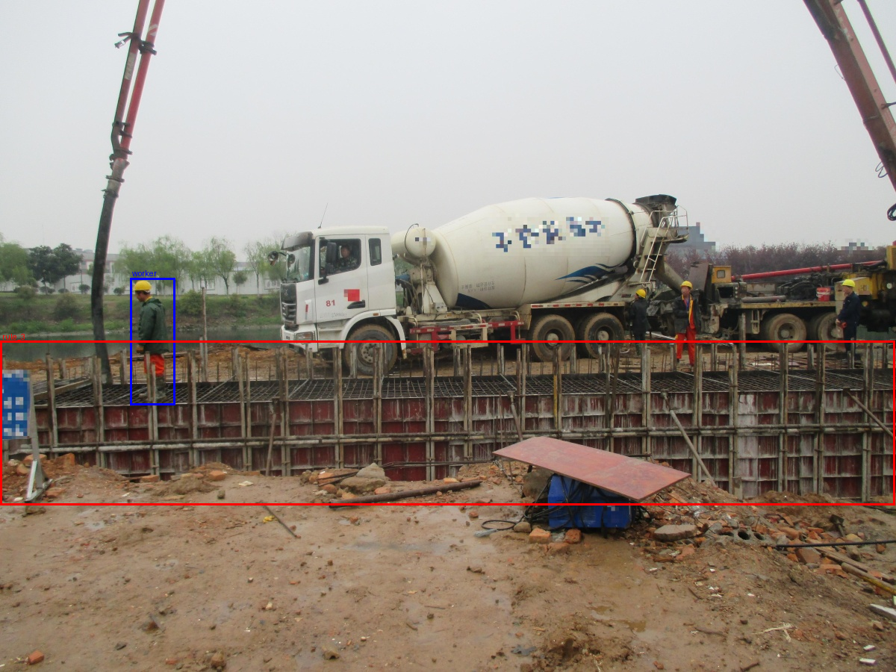{width=72%}

**Correction.** The proxy was redesigned as a **person-relative** check. Workers and rule-relevant safety objects are detected independently, after which the geometric logic tests whether each detected worker is covered by a nearby safety object.

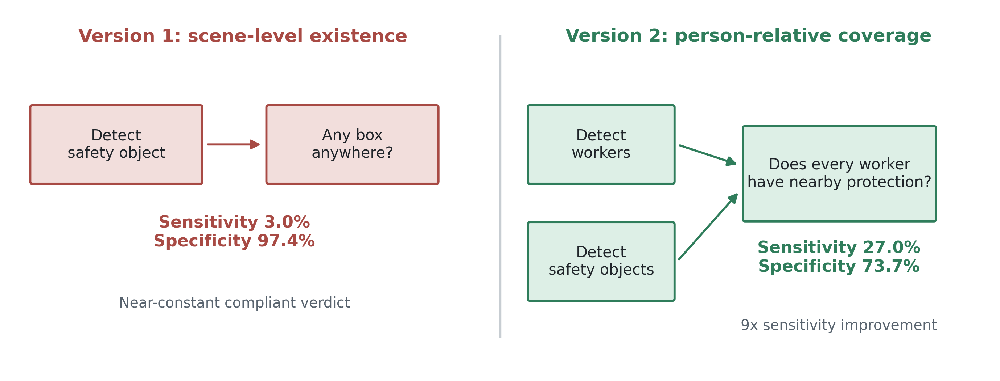{width=100%}

\begin{figure}[htbp]
\centering
\begin{subfigure}[t]{0.48\textwidth}
\includegraphics[width=\linewidth]{../pilot/results/figures/baseline/0000007_rule_1.png}
\caption{Rule 1: a hard-hat query grounds the safety object in a multi-worker scene.}
\end{subfigure}\hfill
\begin{subfigure}[t]{0.48\textwidth}
\includegraphics[width=\linewidth]{../pilot/results/figures/baseline/0000120_rule_4.png}
\caption{Rule 4: worker and excavator boxes support the proximity check.}
\end{subfigure}
\caption{Examples of well-localized detections supplied to the person-relative proxy.}
\end{figure}

**Effect of the correction.**

| Proxy version | Sensitivity | Specificity |
|---|---|---|
| v1 - scene-level existence check | 3.0% | 97.4% |
| v2 - person-relative check | **27.0%** (9× better) | 73.7% |

Sensitivity increased ninefold, from 3.0% to **27.0%**, while specificity decreased from 97.4% to 73.7%. The reduction in specificity reflects the transition from a near-constant "compliant" response to a proxy that identifies more violations. `rule_4`, which already used worker-to-excavator proximity rather than scene-level existence, did not require this redesign and produced sensitivity/specificity of 61.5%/41.7%.

**Residual limitation.** Florence-2's `"worker"` query returns only **one** box in the pilot configuration, including scenes with several workers. If the returned box corresponds to a compliant worker, a violation associated with another undetected worker cannot be evaluated. Alternative task tokens for multi-worker enumeration are therefore reserved for controlled validation in Section 6.

## Stage 04: Region Standardization

**Input and transformation.** The model-returned boxes from Stage 03 are standardized and ranked as candidate explanation regions for subsequent masking and tracking.

**Result.** A model-returned box was available for **159 of 163 images (97.5%)**. The remaining four images used an unranked grid fallback.

**Ranking limitation.** Florence-2 returns boxes without an importance score. The pilot therefore ranked candidates by pixel area, with the largest box first. Although this policy provided a usable region for every image, area is a weak proxy for safety relevance: a worker body is typically larger than the associated hard hat. The policy consequently favors worker regions over smaller safety objects. Stages 05, 07, and 10 quantify the resulting distortion, and Section 6 evaluates the rule-aware correction.

**Example.** Image `0000007` (`rule_1`, hard hat) contains a large worker box and a smaller hard-hat box. Area-based standardization produces the following order:

1. **Region 1 (rank 1, "top region"):** the worker's body box - large, so it wins by the area rule, even though the rule is actually about the hard hat.
2. **Region 2:** the hard hat box - small, so it ranks second, even though it's the object rule_1 is actually checking.

Every downstream metric that says "mask/track the top region" is therefore masking/tracking the **worker**, not the hard hat, for this image - exactly the mechanism flagged above.

\begin{figure}[htbp]
\centering
\begin{subfigure}[t]{0.48\textwidth}
\includegraphics[width=\linewidth]{figures/region_before.png}
\caption{Area ranking selects the worker body as the top region.}
\end{subfigure}\hfill
\begin{subfigure}[t]{0.48\textwidth}
\includegraphics[width=\linewidth]{figures/region_after.png}
\caption{The selected worker region is masked before re-inference.}
\end{subfigure}
\caption{Region standardization and masking for image 0000007 under the frozen area-ranking policy.}
\end{figure}

## Stage 05: Descriptive Accuracy

**Input and transformation.** The top-ranked region from Stage 04 is masked, and the model-proxy pipeline is rerun. A verdict change indicates that the removed region contributed necessary decision evidence.

**Result.** Masking the top region changed the verdict in **36.2%** of the 163 images. In a representative struck-by-risk example, removing the excavator region eliminated one side of the proximity comparison and changed the verdict from hazard to safe.

**Validity assessment.** The metric produced non-trivial sensitivity to region removal, but the rule-level breakdown reveals systematic variation:

| Rule | Top-1 flip rate |
|---|---|
| rule_4 (excavator proximity) | 44.0% |
| rule_3 (guardrail) | 42.9% |
| rule_2 (harness) | 38.5% |
| rule_1 (hard hat) | 27.0% |

This ordering matches the proxy-sensitivity ordering from Stage 03. A weakly discriminative baseline provides little decision signal for masking to disrupt, while area-based ranking can remove the worker rather than the rule-relevant safety object. The pilot preserves this result as a diagnostic; Section 6 evaluates the ranking correction.

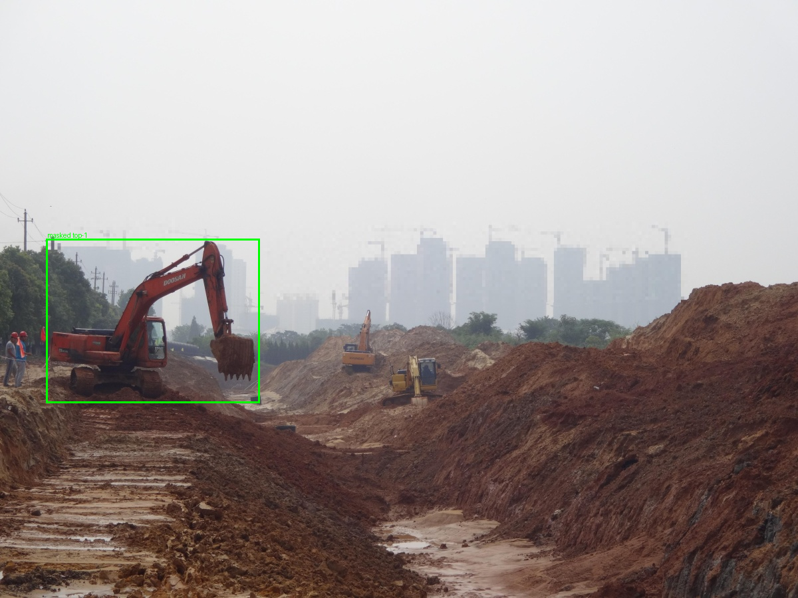{width=72%}

## Stage 06: Visual Sparsity

**Input and transformation.** Decoder-to-encoder cross-attention is extracted during phrase grounding and summarized as the proportion of attention mass concentrated in the most active image patches.

**Architecture-specific adaptation.** The planned attention-rollout method assumes a vision-only encoder. Florence-2 mixes image and text tokens in a shared encoder stack, so that assumption does not hold. Source-level verification established that decoder-to-encoder **cross-attention** was the applicable extraction mechanism. The conceptual sparsity construct remains unchanged; only the architecture-specific attribution method differs.

**Result.** The 159 images with model-returned regions produced a mean top-5-of-576-patch mass ratio of **0.108**. Grid-fallback cases were excluded because they lacked a grounded phrase for attribution.

**Limitation.** Phrase-level analysis exposed a strong object-size confound:

| Phrase | Top-5 mass ratio |
|---|---|
| hard hat | **0.195** (most concentrated) |
| safety harness | 0.118 |
| worker | 0.115 |
| guardrail | 0.099 |
| excavator | **0.079** (least concentrated) |

A hard hat looks "focused" mainly because it's *small* - it only takes a few cells to cover it. An excavator looks "scattered" mainly because it's *large*. Across the dataset, this correlation between concentration and plain object size is strong (-0.70). **This means we cannot yet compare sparsity across rules fairly** - a small-object rule will always look more "focused" than a large-object rule, independent of explanation quality. We did not fix this inside the pilot (a size-corrected version is a scale-up item, §6); the value here was pinning down, with a number, that the confound is real and how strong it is.

\begin{figure}[htbp]
\centering
\begin{subfigure}[t]{0.48\textwidth}
\includegraphics[width=\linewidth]{figures/sparsity_focused.png}
\caption{A small hard hat produces a concentrated attention map.}
\end{subfigure}\hfill
\begin{subfigure}[t]{0.48\textwidth}
\includegraphics[width=\linewidth]{figures/sparsity_scattered.png}
\caption{A large guardrail produces a more dispersed attention map.}
\end{subfigure}
\caption{The pilot sparsity measure is confounded by the physical size of the grounded object.}
\end{figure}

## Stage 07: Stability

**Input and transformation.** The pipeline is rerun with controlled decoding randomness, and both verdict agreement and region displacement are measured. Deterministic repetition is excluded because it would produce a vacuous 100% agreement result.

**Result.** Across three reruns, answer agreement was **77.5%**, and mean overlap for the **area-ranked top region** was **0.667**.

**Measurement limitation.** The 0.667 overlap primarily reflects the area-ranked region, which is frequently the **worker** rather than the safety object. A separate analysis of the rule-specific object produced materially different results:

| Rule | Answer agreement | Object-box overlap (the metric that matters) |
|---|---|---|
| rule_1 (hard hat) | 0.735 | **0.499** |
| rule_2 (harness) | 0.744 | 0.533 |
| rule_3 (guardrail) | 0.782 | 0.615 |
| rule_4 (excavator) | 0.893 | **0.922** |

The 0.667 headline was substantially measuring how stable the (large, easy-to-detect) **worker** box is, not the small PPE object the rule is actually about. The true safety-relevant object for rule_1 is stable only **49.9% of the time** - the worker box's stability was masking this. We report both numbers, side by side, precisely so this doesn't get hidden - a direct instance of the Stage 04 risk causing real measurement distortion, not just a theoretical concern.

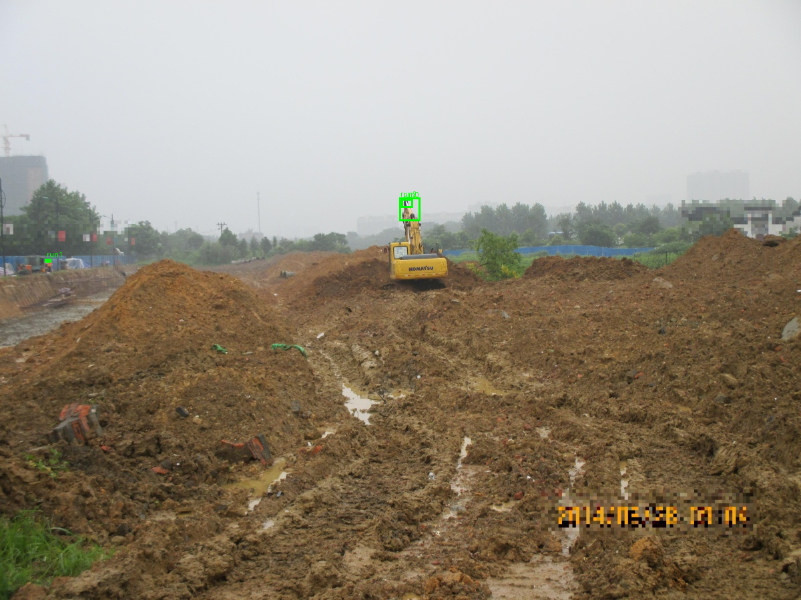{width=64% height=2.15in}

\clearpage

## Stage 08: Efficiency

**Input and transformation.** Each pipeline stage is timed, and the observed runtime is projected to larger evaluation sets.

**Result.** The complete six-metric pipeline requires approximately **0.5 GPU-hours per 1,000 images** on an RTX 3070.

**Scalability assessment.** The measured cost does not constitute a practical barrier to scale-up. The principal constraints are methodological validity and measurement correctness rather than baseline compute.

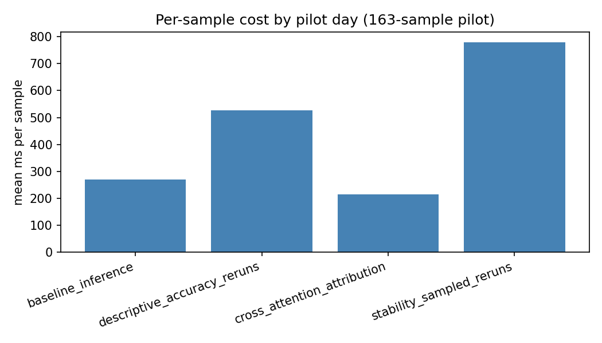{width=80%}

\clearpage

## Stage 09: Robustness

**Input and transformation.** Mild blur, low-light, occlusion, contrast, and prompt-rewording perturbations are applied independently. The pipeline then measures verdict survival and explanation-region displacement.

**Result.**

| Perturbation | Answer changed | Worker lost (fallback risk) |
|---|---|---|
| occlude | 28.2% | 8.6% |
| reworded prompt | 27.5% | 0.0% |
| blur | 27.0% | 0.0% |
| low light | 11.7% | 0.6% |
| contrast shift | 10.4% | 0.0% |

Overall Level-1 answer survival: **80.7%**.

**Limitations.** Two distinct failure mechanisms were identified and traced to individual cases:

1. **A fallback artifact under occlusion.** Of occlude's answer-flip cases, 20% also lost the worker box entirely. Traced concretely: on one image, *both* baseline detections were already wrong by accident (a "worker" box that was really a false positive on an excavator's cab window; a "guardrail" box that was really the whole excavator) - they happened to geometrically satisfy the rule anyway, producing a right-for-the-wrong-reason "compliant." After occlusion, both wrong boxes vanished, and the code's fallback logic defaulted to "violation" - a flip caused by a detection dropout, not by genuinely disrupting the safety-relevant evidence. **Fix (standardized as of the scale-up, §6):** record whether the worker box survived every re-run, and report each metric twice - the raw flip rate and the rate with worker-loss flips excluded.
2. **The pilot's single strongest finding:** in **28.3%** of cases where the final answer did *not* change, the model's evidence box nonetheless drifted to something unrelated. An answer-only metric would certify these as perfectly robust; they are not. This is direct proof that answer-level robustness alone is not enough - the explanation has to be checked too, never blended into one number.

We did not change the metric's design mid-pilot; both findings were measured, traced to a concrete case, and carried forward as scale-up requirements.

\begin{figure}[htbp]
\centering
\begin{subfigure}[t]{0.48\textwidth}
\includegraphics[width=\linewidth,height=1.85in,keepaspectratio]{figures/drift_before.png}
\caption{Baseline evidence region.}
\end{subfigure}\hfill
\begin{subfigure}[t]{0.48\textwidth}
\includegraphics[width=\linewidth,height=1.85in,keepaspectratio]{figures/drift_after.png}
\caption{Perturbed evidence region; the answer remains unchanged although IoU falls to 0.005.}
\end{subfigure}
\caption{Explanation drift hidden by an answer-level robustness result.}
\end{figure}

\begin{figure}[htbp]
\centering
\begin{subfigure}[t]{0.48\textwidth}
\includegraphics[width=\linewidth,height=2.70in,keepaspectratio]{figures/occlude_fallback_before.png}
\caption{Baseline detections are already incorrect but happen to satisfy the rule.}
\end{subfigure}\hfill
\begin{subfigure}[t]{0.48\textwidth}
\includegraphics[width=\linewidth,height=2.70in,keepaspectratio]{figures/occlude_fallback_after.png}
\caption{Occlusion removes both detections and triggers the fallback verdict.}
\end{subfigure}
\caption{Worker-loss fallback artifact traced to image 0000341.}
\end{figure}

\clearpage

## Stage 10: Bounded Completeness

**Input and transformation.** The top-ranked region is removed and the pipeline is rerun as a bounded necessity test. An unchanged verdict indicates that the selected region was not necessary for the reported decision.

**Result.**

| Verdict | Count | % |
|---|---|---|
| `explanation_supported` (region was necessary) | 71 | 43.6% |
| `explanation_weak` (removing it changed nothing) | 88 | 54.0% |
| `no_usable_explanation` | 4 | 2.5% |

**Validity assessment.** The rule-level breakdown reproduces the area-ranking mechanism observed in Stages 05 and 07:

| Rule | Supported |
|---|---|
| rule_1 (hard hat) | **33.3%** (weakest) |
| rule_2 (harness) | 46.2% |
| rule_3 (guardrail) | **55.1%** (strongest) |
| rule_4 (excavator) | 44.0% |

A 22-point spread, and once again rule_1 (the smallest object, most disadvantaged by area-ranking) comes out weakest. **One additional check we ran here, beyond what the plan required:** an extra 159-rerun audit specifically for the worker-loss fallback (the same mechanism found in Stage 09), which corrected the headline number from 43.6% down to **41.7%**. This is a small but real inflation, caught and corrected rather than reported uncritically.

\begin{figure}[htbp]
\centering
\begin{subfigure}[t]{0.48\textwidth}
\includegraphics[width=\linewidth,height=1.75in,keepaspectratio]{figures/completeness_before.png}
\caption{Worker and harness detections occupy nearly the same region.}
\end{subfigure}\hfill
\begin{subfigure}[t]{0.48\textwidth}
\includegraphics[width=\linewidth,height=1.75in,keepaspectratio]{figures/completeness_after.png}
\caption{Masking erases both detections and activates the fallback branch.}
\end{subfigure}
\caption{A bounded-completeness flip caused by fallback mechanics rather than genuine necessity.}
\end{figure}

\clearpage

## Stage 11: Roll-Up and Reproducibility

**Input and transformation.** The stage aggregates all six metric files into cross-metric tables and figures.

**Result.** The aggregation produced a class-stratified summary of the five per-sample metrics, together with the efficiency analysis reported separately.

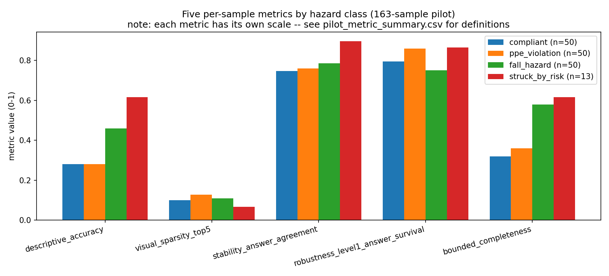{width=100%}

**Reproducibility assessment.** The committed code was exported to a clean directory, installed in a new environment, and used to rerun all 11 stages and the test suite on a fresh 20-image subset without manual intervention. Every stage completed successfully. The different sample size also exposed a latent figure-generation defect: legend counts and a title were hardcoded to the original 163-image pilot. Both values were replaced with data-derived values. A subsequent rerun on the 163-image pilot confirmed that the correction changed presentation logic only and left all reported pilot measurements unchanged.

## Cross-Cutting Findings

Joint analysis of the eleven stages identifies four cross-cutting mechanisms:

1. **One ranking choice (Stage 04) weakens three later metrics at once** (Stages 05, 07, 10) - because a worker's body is almost always a bigger box than the safety object, masking/tracking/necessity tests keep testing the wrong thing on exactly the rules that matter most. **This is the single highest-leverage fix for the scale-up.**
2. **A fallback branch recurs across three separate tests** (Stage 03's proxy logic, Stage 09's occlusion, Stage 10's completeness check) - losing the worker box reroutes the code into a degenerate answer for reasons unrelated to the actual safety concept. Found and quantified each time it appeared, not left as unexplained noise.
3. **Object size confounds two metrics** (Stage 06 sparsity, Stage 07 stability) - both are, in part, measuring how big the object is rather than how good the explanation is.
4. **The model never makes the actual safety judgment** (Stage 03) - a hand-written geometric rule does. This means several metrics partly measure that rule's sensitivity, not the model's own reasoning. This is the deepest finding of the entire pilot, and it is the reason Part B exists.

---

# Part B: Scale-Up and Decision Framework {.unnumbered}

# Scale-Up Plan and Current Status

## Scale-Up Objective

The pilot did what it was supposed to do: it found the places where a tabular XAI evaluation does not transfer cleanly to an image-and-language model. The scale-up is the repair-and-validation plan. Its central goal is:

> Make each metric measure **the model's faithfulness** - whether the model's own answer is supported by its own evidence - rather than the sensitivity of the hand-written geometric proxy sitting after the model.

This goal does not mean throwing away Florence-2 or redesigning the six metrics. Florence-2 remains useful because it produces inspectable regions cheaply. The six-metric structure also remains unchanged. The scale-up instead removes known confounds, adds the missing controls, strengthens the statistics, and then compares the grounding-proxy path with a model that can answer the safety question directly.

## Phase Structure and Status

The plan is divided into six phases. Phase 0 is a decision gate. Phases 1-3 strengthen the existing study. Phases 4-5 broaden what counts as an explanation and what models and data the methodology is tested on.

| Phase | Purpose | Current status |
|---|---|---|
| Phase 0 | Lock four choices: attribution method, model scope, multi-label class labeling, and the Florence-2 detection task token | **Sign-off still needed**; the choices are stated in §7 |
| Phase 1 | Fix foundational correctness problems in ranking, sampling, context assignment, fallback handling, prompts, decoding, and hardcoded assumptions | **Done** - commit `68c90da` |
| Phase 2 | Add validity controls so each of the six metrics measures what it claims | **Done** - commit `ac69a27` |
| Phase 3 | Add confidence intervals, significance tests, minimum sample-size rules, multiple seeds, and reproducibility hardening | **In progress** - Phase 3.1 committed in `84ec951`; Phase 3.2 written but uncommitted |
| Phase 4 | Add and compare attribution streams | **Not started** - gated mainly on the Phase 0 attribution decision |
| Phase 5 | Expand the model and dataset scope: Qwen2.5-VL, SODA, and CMA, while retaining Florence-2 | **Not started** - gated mainly on the Phase 0 model-scope decision |

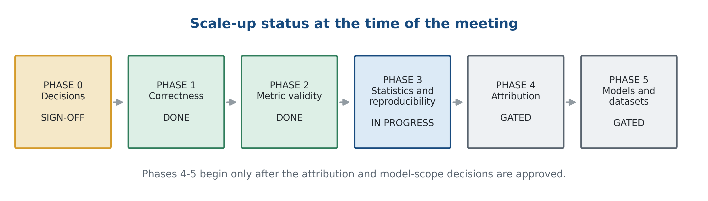{width=100%}

The important point is that "done" here means **implemented behind flags, tested, and measured against the frozen pilot**, not that every scale-run experiment has already been executed. The original pilot path remains reproducible beside the corrected path, so an improvement can always be compared with the record it replaces.

## Phase 1: Foundational Correctness Fixes

Phase 1 addressed the problems that could contaminate several later metrics at once. All seven items are committed in `68c90da`.

### Phase 1.1: Rule-Aware Region Ranking

**Method.** Replaced "largest box first" with a rule-aware ranking option. A box whose label matches the object named by the safety rule is promoted ahead of the worker body. Area is now only a tie-breaker inside the correct semantic group.

**Result.** Among the 159 pilot samples with a real model box, area-ranking put the worker body first in **50.3%** of cases. Rule-aware ranking reduced that to **0.6%** - one sample. It put the queried safety object first in **100%** of rule_1-rule_3 cases and **96%** of rule_4 cases. For PPE specifically, the top region changed in **92.1%** of samples.

The old worker-versus-object descriptive-accuracy gap therefore disappeared because almost no worker-ranked group remained. PPE's own top-1 flip rate rose from **27.0% to 33.3%** when the mask moved from the worker to the hard hat. The aggregate object-mask rate did not inflate; it settled at **39.2%**, which is useful evidence that the correction removed a confound rather than manufacturing a better-looking score.

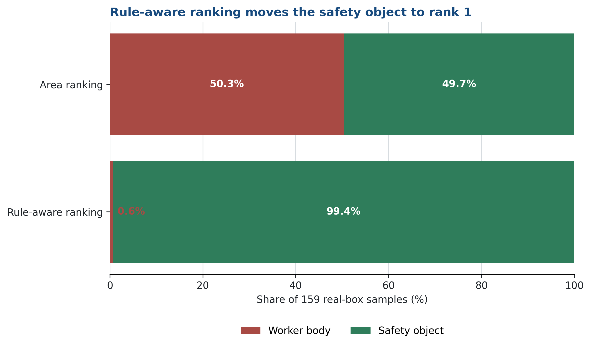{width=82%}

### Phase 1.2: Multi-Label Classification and Sampling

**Method.** Changed the sampling layer so an image can count toward every class it actually violates. The frozen pilot still uses mutually exclusive priority labels by default; the scale-up option uses multi-label coverage and can assign an image to every relevant rule.

**Result.**

| Test-split class | Priority labeling | Multi-label coverage |
|---|---:|---:|
| `ppe_violation` | 324 | 324 |
| `fall_hazard` | 75 | 86 |
| `struck_by_risk` | **13** | **24** |
| `compliant` | 2,592 | 2,592 |

The 11 recovered struck-by images are not newly invented labels. Each already carried rule_4, but priority-collapse had filed it under another violation. The sampler and manifest now preserve that information. The train split can supplement the minority class toward the plan's roughly 70-example target, but that larger draw and the full downstream scale-run consumption are not yet completed results.

### Phase 1.3: Context-Matched Compliant Samples

**Method.** Replaced blind round-robin assignment with context matching wherever reliable metadata exists. The strongest available signal is whether an excavator is present, so a compliant image is assigned rule_4 only when the struck-by context is actually in the scene.

**Result.** Of **2,592** compliant test images, **915** contain an excavator. Round-robin assigned 648 images to rule_4, but **413 of those 648 (63.7%)** had no excavator; at the same time, it failed to test **680** images that did contain one. Context matching assigns all 915 excavator scenes to rule_4 and produces **zero** excavator-free rule_4 tests.

This fixes the measured struck-by context problem. It does not pretend metadata can solve everything. The remaining **1,677 compliant images (64.7%)** are explicitly marked `context_absent` because the context for rules 1-3 still needs a grounding pre-check. The uncertainty is now visible instead of silently counted as correct.

### Phase 1.4: Worker-Loss Instrumentation

**Method.** Every metric that masks or perturbs an image now records whether the worker box disappeared. Each result can be reported twice: the raw rate and the worker-loss-corrected, or **genuine**, rate.

**Result.**

| Measurement | Raw | Worker-loss-corrected |
|---|---:|---:|
| Descriptive Accuracy, area ranking | 36.2% | 34.4% |
| Descriptive Accuracy, rule-aware ranking | 38.7% | 37.4% |
| Robustness answer change, centered occlusion | 28.2% | **22.7%** |
| Bounded Completeness, area ranking | 43.6% | 41.1% |
| Bounded Completeness, rule-aware ranking | 47.9% | 46.0% |

The largest correction is exactly where the pilot predicted: centered occlusion. Covering part of the worker often removes the worker detection and sends the proxy down its fallback branch. The 5.5-point difference between 28.2% and 22.7% is therefore not treated as model sensitivity anymore.

The 41.1% completeness value is one sample lower than the **41.7%** ad hoc audit reported in §5. The reason is explicit: the earlier audit corrected worker loss after the top-1 mask only; the standardized Phase 1.4 roll-up corrects it after both the top-1 and top-2 masks and catches one additional fallback case.

### Phase 1.5: Concept and Synonym Separation

**Method.** Rebuilt the prompt dictionary as `{concept: [true synonyms]}`. A hard hat and a high-visibility vest are different concepts. A safety harness and a lanyard are also different concepts. A robustness test may reword a concept, but it may not silently swap in a different object.

**Result.** On 20 samples per rule, the proposed hard-hat synonym `"safety helmet"` had **0.281** box agreement with `"hard hat"`; the different concept `"high-visibility vest"` had **0.000**. For rule_2, `"fall-arrest harness"` had **0.426** agreement with `"safety harness"`; the different concept `"fall-protection lanyard"` again had **0.000**. The different-object phrases still grounded boxes - 18/20 for the vest and 13/20 for the lanyard - but they grounded a different place. That proves the old "rewording" test was partly an object-swap test. The corrected structure removes that ambiguity; a full-set synonym validation remains a scale-run check.

### Phase 1.6: Unified Decoding

**Method.** Standardized baseline inference, masking, robustness, and attribution on greedy decoding. Stability still uses sampled reruns because controlled randomness is the point of that metric, but it now compares them with a greedy anchor.

**Result.** Greedy and the pilot's beam-search baseline agreed on **93.3%** of the 163 answers; **11** answers differed. Mean inference time was **271 ms** under beam search and **261 ms** under greedy. The cost was essentially unchanged, but the 6.7% disagreement showed that the old pipeline sometimes explained a greedy answer while reporting a beam-search answer. The unified path removes that mismatch by construction.

### Phase 1.7: Hardcoded-Assumption Audit

**Method.** Replaced literal sample counts, labels, model IDs, and patch-grid dimensions with values derived from data or configuration. Added a test that fails if known magic literals return to executable code.

**Result.** The derived patch grid reproduces **24×24** for the pilot's 768×768 input and adapts to **32×24** for a 1024×768 input. The guard passes, and the full suite at the end of this phase reports **110 tests passed**. This prevents a new model or input resolution from silently shifting the attention heatmap away from the image.

**Phase 1 synthesis.** The corrected pipeline now selects the safety object, preserves multi-hazard labels, makes vacuous context visible, separates worker-loss artifacts, uses real synonyms, explains the same decoder it reports, and derives its assumptions from data. These fixes make the existing Florence-2 proxy cleaner. They do not yet solve the deeper question of whether the final verdict belongs to the model or to the geometric rule - that is why Phases 4-5 still matter.

## Phase 2: Metric-Validity Corrections

Phase 2 took the six metrics one by one and tested whether the proposed correction actually removed the pilot's confound. All six items are committed in `ac69a27`.

### Phase 2.1: Descriptive-Accuracy Validity

**Method.** Added three mask modes, a continuous score, an automatic non-monotonicity flag, and a text-ablation probe. Visual and text ablation remain separate measurements.

**Result.** Top-1 flip rates stayed in a narrow band: **36.2%** for a black mask, **34.4%** for blur, and **33.1%** for inpainting. This shows the result is not mainly an artifact of the black patch. The invariant automatically found the same **15** non-monotonic area-ranking cases previously traced by hand, and **22** under rule-aware ranking.

The continuous score is implemented but currently binary in practice. Florence-2 found exactly one worker in **151** images, no worker in **12**, and more than one worker in **zero**. With only one worker, "fraction of workers covered" can only be 0 or 1. This is a measured reason to revisit the detection token in Phase 0, not a reason to hide the empty middle of the score.

Text ablation flipped **38.0%** of samples; visual ablation flipped **38.7%**. Their rates look alike, but their cases do not: 30 samples flipped only under text ablation and 31 only under visual ablation. The two modalities are contributing different information, so they must remain separate results.

### Phase 2.2: Size-Robust Sparsity

**Method.** Tested the plan's proposed size correction instead of assuming it would work. It did not. Attention mass divided by box footprint was more correlated with object size than the pilot score. We therefore tested a box-independent Gini coefficient over the attention map.

**Result.**

| Sparsity measure | Correlation with log box area |
|---|---:|
| Pilot top-5 mass ratio | -0.755 |
| Planned mass ÷ footprint correction | **-0.828** |
| Mass inside the box | +0.819 |
| Box-independent Gini | **-0.437** |

The original size confound is roughly halved under Gini, and the per-rule ordering no longer simply follows object size. This is a useful negative result: the planned formula made the metric worse, and the measured alternative was adopted instead. The remaining -0.437 correlation is still reported, so Gini is treated as **size-robust**, not perfectly size-free.

### Phase 2.3: Stability Across Sampling Temperatures

**Method.** Ran 10 reruns per image on a 40-image subset at temperatures 0.3, 0.5, 0.7, and 1.0. Added normalized centroid distance and object-presence stability beside IoU.

**Result.** Answer agreement decreased smoothly from **0.871** at temperature 0.3 to **0.797** at 1.0. Object-box IoU fell more sharply, from **0.730 to 0.472**, but normalized centroid distance moved only from **0.055 to 0.106** of the image diagonal. The boxes were mostly jittering around the same place, not relocating as dramatically as IoU implied.

Object presence stayed near **0.95**, but four samples flickered - the object appeared in some reruns and vanished in others. The pilot had dropped these cases as undefined IoU. They now count as instability. The full 163-image temperature sweep is still a scale-run task.

### Phase 2.4: Robustness Severity and Location Controls

**Method.** Replaced one fixed perturbation level with severity curves. Separated targeted, centered, and random occlusion. Added size-invariant centroid drift and explicit box-disappearance rates.

**Result.** The severity curves behaved as expected: stronger gamma, blur, and occlusion produced more answer change and more centroid drift; the contrast curve moved in the correct reverse direction because a smaller factor is the stronger flattening.

Occlusion location produced the clearest result:

| Occlusion location | Answer-flip rate |
|---|---:|
| Targeted - covers the safety object's box | **39.2%** |
| Centered - the pilot method | 25.6% |
| Random location, matched area | **17.2%** |

The pilot's centered square had mixed two different questions: "did we remove the safety object?" and "did we disrupt the image somewhere?" The split now answers them separately.

The pilot's 28.3% hidden-drift finding also became more precise. Under the rerun, IoU marked **25.0%** of stable-answer cases as drifted, but only **13.7%** moved more than 0.2 of the image diagonal. The finding survives - stable answers can hide explanation movement - but roughly half of the old magnitude was small-box IoU bias. Box disappearance, including **5.1%** under targeted occlusion, is now reported rather than dropped.

### Phase 2.5: Multi-Hazard Bounded Completeness

**Method.** Used the multi-label path to test each image against every rule it violates. The worker-loss correction is part of the headline result, and the report states plainly that Bounded Completeness is built from the same masking results as Descriptive Accuracy; the two are not independent confirmations.

**Result.** The test split contains **22** images with two or more violated rules:

| Multi-hazard completeness | Count | Share |
|---|---:|---:|
| Complete - every hazard's region is load-bearing | 6 | 27.3% |
| Partial - some hazards supported, not all | 10 | 45.5% |
| None supported | 6 | 27.3% |

On average, the explanation supported **1.05 of 2.09** hazards per image. This is strong evidence that a one-phrase-at-a-time proxy often explains one visible hazard and misses another. But with n=22, the 27.3% rate is an existence result, not yet a stable population estimate.

### Phase 2.6: Measured Efficiency

**Method.** Timed 60 real samples after discarding five warm-up samples. GPU work is synchronized at the boundary, and GPU-compute time is reported separately from end-to-end wall time.

**Result.** Mean GPU time was **264.7 ms per sample**, median **254.0 ms**, and p90 **299.5 ms**. End-to-end wall time was effectively identical, giving a GPU-to-wall ratio of **1.00**. With the local data cache, the run is GPU-bound rather than network- or Python-bound. At this measured cost, one metric pass over the 3,004-image test split is about **13 GPU-minutes**. Cluster batching and re-costing after the attribution and detection decisions remain future measurements.

**Phase 2 synthesis.** All six metrics now carry the image-specific controls the pilot showed they needed: mask-mode checks, separate text and image ablation, a size-robust sparsity measure, a temperature curve, size-invariant spatial drift, targeted-versus-random perturbations, multi-hazard completeness, worker-loss correction, and real timing. The important pattern is methodological: proposed fixes were measured, and when one made the confound worse - the planned sparsity correction - it was rejected.

## Phase 3: Reproducibility and Statistical Inference

Phase 3 is not one finished block. The statistics foundation is committed. The multi-seed selection harness is written and measured, but it is still uncommitted work, and the complete multi-seed metric run has not happened.

### Phase 3.1: Confidence Intervals, Paired Tests, and Minimum Sample Size

**Method.** Added bootstrap 95% confidence intervals, Wilcoxon signed-rank tests for paired comparisons, and an enforceable provisional minimum sample-size floor of **n = 30**. The floor follows the plan's recommended default but still needs the Phase 0 statistical sign-off described in §7. This work is committed in `84ec951`.

**Result.**

| Headline result | Estimate and 95% bootstrap CI | n |
|---|---:|---:|
| Descriptive Accuracy, top-1 | 36.2% [28.8, 43.6] | 163 |
| `struck_by_risk` Descriptive Accuracy | 61.5% [38.5, 84.6] | **13 - below floor** |
| Multi-hazard completeness | 27.3% [9.1, 45.5] | **22 - below floor** |

The intervals change the interpretation. `struck_by_risk` looked like the strongest class as a point estimate, but its interval is about 46 points wide. Multi-hazard completeness is similarly underpowered. Both are now automatically flagged rather than presented as stable facts.

Two Phase 2 comparisons also passed paired significance tests: targeted versus random-location occlusion drift (**p = 0.0011**) and stability agreement at temperature 0.3 versus 1.0 (**p = 0.018**). These are the first project comparisons supported by significance tests instead of visual differences alone.

### Phase 3.2: Multi-Seed Selection

**Current implementation.** Added seeds 42-46, a mean pairwise Jaccard helper, and a `--seeds` selection mode. The mode reads the test split once, makes five seeded selections, and reports class counts and overlap without overwriting the frozen seed-42 manifest.

**Result.** Every seed produced the same actual class counts: **50 PPE, 50 fall-hazard, 13 struck-by-risk, and 50 compliant** - 163 selected images against the 200-image target. The mean pairwise Jaccard overlap was **0.222**, and the five selections collectively used **475 distinct images**. Class balance is stable, but the actual images vary substantially, so the seed-42 pilot is one draw rather than a complete estimate of draw-to-draw variation.

`struck_by_risk` shows zero seed variation for the wrong reason: all 13 available priority-labeled images are selected every time. This is **exhaustion, not stability**. Re-seeding cannot create information; the class needs the multi-label recovery and additional data.

**Remaining work.** The code and tests are currently modified but uncommitted in:

- `pilot/scripts/02_select_samples.py`
- `pilot/src/xai_pilot/config.py`
- `pilot/src/xai_pilot/stats.py`
- `pilot/tests/test_stats.py`
- `pilot/report/scaleup/main.tex`

The chapter `pilot/report/scaleup/phase3_2_multiseed.tex` is new and untracked. The harness has measured sample-selection variation, but the six metrics have not yet been run across all five seeds and combined as mean plus confidence interval. Phase 3 also still has environment/container and fully programmatic report-generation work in the plan. For those reasons, Phase 3 is accurately labeled **in progress**, not done.

## Phases 4-5: Attribution, Models, and Datasets

**Phase 4: attribution streams.** The plan keeps Florence-2's decoder-to-encoder cross-attention and proposes Integrated Gradients as a second, independent explanation stream. Agreement between the two would be reported instead of trusting one extraction method. This work has not started because the attribution choice changes precision, compute, and model-specific adapter work. It needs the Phase 0 attribution decision first.

**Phase 5: model and dataset scope.** The plan keeps Florence-2 as the region-native grounding baseline, then adds Qwen2.5-VL 3B and 7B in two carefully separated modes:

1. the **same grounding proxy**, to test whether a better detector improves the existing pipeline; and
2. **native VQA**, where the model answers the safety question itself.

The second comparison is the one that directly addresses the scale-up's central goal. It lets the metrics evaluate the faithfulness of a model-made safety answer rather than the sensitivity of a hand-written geometric verdict.

The planned data expansion also has three different jobs: the ConstructionSite test split for the main scale run, SODA for out-of-distribution site and weather conditions, and CMA video clips for frame-to-frame explanation stability. None of these Phase 5 runs has started. Model scope, compute, attribution compatibility, and the detection-token choice must be settled before they are treated as committed experiments.

## Current Interpretation

The scale-up has already changed the interpretation of the pilot in four concrete ways:

1. **The largest confounds were fixable.** Rule-aware ranking, worker-loss correction, context matching, and unified decoding remove artifacts that had affected several metrics at once.
2. **Some headline findings became narrower but more credible.** Robustness drift survives, but the size-controlled positional-move rate is 13.7%, not an unqualified 28.3%. Completeness survives, but its multi-hazard estimate is explicitly underpowered.
3. **The data problem is now precisely located.** Multi-label recovery raises the test-split struck-by pool from 13 to 24, while the statistics and seed sweep show why 13 cannot support a stable claim.
4. **The deepest limitation remains open.** Florence-2 still detects objects while code makes the safety decision. Phases 1-3 make that proxy cleaner and its measurements more honest. Phases 4-5 are what will determine whether the same six metrics measure a native VLM's own reasoning.

That last step depends on a small set of choices. §7 states those choices plainly, gives the recommended defaults, and ends with the exact decisions requested for the meeting.

---

# Open Decisions and Recommended Approaches

## Decision Context

Phases 1-3 answered many technical questions by implementing a correction and measuring the result. The remaining questions are different. They change the scientific scope, the meaning of the final comparison, or the standard required before a number can enter the paper. Those choices need agreement before Phases 4-5 begin.

This section separates three things for each open decision:

1. **What is still unclear.**
2. **The recommended default.**
3. **What changes if we choose differently.**

## Resolved Design Issues

The pilot report originally ended with six questions. Two have since been resolved by evidence:

- **Rule-aware region ranking is implemented.** Phase 1.1 reduced top-ranked worker boxes from 50.3% to 0.6% and promoted the rule's queried object in essentially every usable case. The frozen area-ranking path remains available for comparison, but there is no longer a good reason to use it as the scale-run default.
- **Rule_2's two phrases are now separate concepts.** Phase 1.5 showed that a harness and a lanyard grounded different regions, with 0.000 box agreement in the validation set. They are no longer treated as synonyms.

Worker-loss correction, context matching, unified decoding, size controls, perturbation sweeps, and multi-hazard reporting are also implemented technical corrections. They should be reported to Professor Abdallah, but they do not require him to choose between unresolved scientific alternatives.

The remaining list is therefore not the old list copied forward. It is the list after reconciling that report with the work completed in Phases 1-3.

## Decision 1: Attribution Evidence

**Open issue.** Florence-2's planned attention-rollout method did not fit its fused image-and-text encoder. The pilot therefore used decoder-to-encoder cross-attention. That method is architecture-aware and produced useful heatmaps, but it is still one attribution stream, and it began as a practical replacement rather than an independently corroborated choice.

There is also a model-scope complication. Florence-2 exposes encoder-decoder cross-attention. Qwen2.5-VL is decoder-only and does not expose the same structure. A single cross-attention implementation therefore cannot be carried unchanged across both models.

**Recommended approach.** Keep cross-attention as Florence-2's primary attribution stream and add **Integrated Gradients through Captum** as a second, independent stream. Run gradient attribution in bf16 or fp32, then report where the two methods agree and disagree. For Qwen2.5-VL, use a model-specific adapter rather than pretending Florence-2's cross-attention exists there.

**Trade-off.** Integrated Gradients requires repeated forward and backward passes. The implementation plan estimates roughly **10-50×** the attribution compute of a single forward pass, and fp16 may underflow the gradients. Choosing it therefore changes precision, memory, runtime, and cluster planning.

If only cross-attention is accepted, Phase 4 is faster and the Florence-2 story stays simple, but the paper rests its attribution claims on one model-specific method. If Professor Abdallah requires Integrated Gradients, DeepLIFT, LRP, or another transformer-native white-box method, the claim becomes stronger but the implementation and cost grow materially. The decision is not "which heatmap looks better." It is what evidence is required before the paper calls an explanation faithful.

## Decision 2: Model and Dataset Scope

**Open issue.** Florence-2 does not make the compliant-versus-violation judgment. It detects boxes, and the geometric proxy makes the verdict. That makes it a useful detector baseline, but it means Descriptive Accuracy, Robustness, and Completeness can partly measure the hand-written rule's sensitivity.

A native-VQA model answers the safety question inside the model. Its XAI scores therefore measure a different and more direct object: whether the model's own judgment depends on the evidence it identifies. Reporting Florence-2 and a native-VQA model in one undifferentiated table would still be unfair, because one answer comes from geometry and the other comes from end-to-end reasoning.

**Recommended approach.** Keep Florence-2 and add **Qwen2.5-VL 3B and 7B**, with two explicitly separate comparisons:

1. **Same-proxy comparison.** Make Qwen use the same detect-then-threshold pipeline. This isolates whether detector quality improves the proxy.
2. **Native-VQA comparison.** Let Qwen answer each safety rule directly. This tests whether the six metrics can measure model faithfulness without the geometric verdict in the middle.

Use one frontier model only as an answer-accuracy reference. An API-only model cannot provide the same internal attention or gradients, so it should not be placed in the white-box attribution table as though it can.

**Trade-off.** The 7B model likely needs cluster hardware, and the two Qwen modes require different attribution and evaluation adapters. Adding SODA and CMA also broadens the paper from one dataset to out-of-distribution and temporal tests. That strengthens external validity, but it increases the chance that the project becomes several partially completed studies instead of one complete study.

If the study stays Florence-2-only, it remains feasible and deeply instrumented, but its central result is about a grounding proxy. If native VQA is added, the project can answer the stronger question - whether the six metrics measure a VLM's own safety reasoning - at the cost of substantially more implementation and experiment scope.

## Decision 3: Multi-Label Evaluation

**Open issue.** Construction images can contain several hazards at once. The pilot forced each image into one class. That discarded real secondary labels and reduced the test-split `struck_by_risk` pool from 24 annotated images to 13 priority-labeled images.

Phase 1.2 already implements multi-label classification and sampling behind a flag. That implementation makes the recommendation executable, but implementation is not the same as research-design approval.

**Recommended approach.** Use **multi-label evaluation** for the scale run. Test an image against every rule it violates, allow the same image to contribute to more than one rule-specific analysis, and report multi-hazard completeness separately.

**Trade-off.** Reusing one image across several rule-level tests means those rows are related, not independent observations. The statistics and train/test accounting must respect that. Supplementing the scarce class from the train split also needs a clear label: those examples can strengthen a minority-class analysis, but they should not be silently mixed into the held-out 3,004-image test result.

If priority labeling is retained, each image appears once and the bookkeeping is simpler, but real hazards are thrown away and the study cannot test the multi-hazard completeness it claims to study. If multi-label is approved, the labeling matches construction reality, but the paper must use grouped or image-aware statistics and keep the held-out test result distinct from any train-split supplement.

## Decision 4: Florence-2 Detection Task

**Open issue.** In the current pilot runs, the `<OPEN_VOCABULARY_DETECTION>` query finds at most one worker: Phase 2.1 recorded one worker in 151 pilot images, none in 12, and more than one in zero. A one-worker detector cannot support a strong completeness claim in a five-worker scene.

It is tempting to assume that `<DENSE_REGION_CAPTION>` or `<OD>` will enumerate every worker. That assumption is not yet measured. A denser task may improve recall, but it may also produce longer, noisier outputs and change decoding cost.

**Recommended approach.** Run `<DENSE_REGION_CAPTION>` and `<OD>` on a labeled validation subset, measure multi-worker recall and safety-object recall, and adopt a new task token only if it clearly improves enumeration. Do not claim that a token "guarantees" all workers until the images show that it does.

**Trade-off.** Longer outputs make greedy-versus-beam decoding relevant again and may materially increase runtime. Dense captions also require a reliable parser that maps free text back to workers, PPE, guardrails, and excavators. Keeping the current task token preserves the frozen baseline, but it also keeps the single-worker ceiling that made the graded Descriptive Accuracy score binary and weakened multi-worker completeness.

This decision is also connected to the geometric thresholds. A task that returns relational phrases such as "worker wearing a hard hat" may reduce dependence on fixed pixel-distance rules. A task that only returns more independent boxes improves enumeration but still leaves the hand-written proximity logic in place.

## Decision 5: Statistical Reporting Standard

**Open issue.** Phase 3.1 has implemented the plan's provisional floor of **n ≥ 30 per class per rule**, bootstrap 95% confidence intervals, and paired Wilcoxon signed-rank tests. The tools are working, but the reporting standard still needs approval.

The need is concrete. The pilot's `struck_by_risk` Descriptive Accuracy is 61.5%, but its 95% interval is **[38.5%, 84.6%]** at n=13. Multi-hazard completeness is 27.3% with an interval of **[9.1%, 45.5%]** at n=22. Those point estimates are findings worth following, but they are not stable class-level estimates.

**Recommended approach.** Approve **n ≥ 30 per class per rule as the minimum reporting floor**, require a 95% bootstrap interval on every headline rate, and use Wilcoxon signed-rank tests for paired comparisons. Any result below the floor should be labeled exploratory or an existence result, not removed and not presented as stable.

**Trade-off.** A higher floor gives stronger estimates but may require train-split supplementation, more datasets, or collapsing some rule-level claims. A lower floor lets every class remain in the main table but preserves very wide uncertainty. The key question is not whether n=30 is mathematically magical; it is what minimum Professor Abdallah considers defensible for this study and target venue.

The multi-seed result reinforces the point. `struck_by_risk` appeared perfectly stable across seeds only because all 13 priority-labeled images were selected every time. That is exhaustion, not reproducibility. No seed policy can substitute for a larger pool.

## Decision 6: Adversarial-Robustness Scope

**Open issue.** The pilot's Level-3 stretch test used a synthetic hard-hat-like patch and produced only four cases where a flip was meaningfully defined. The pilot correctly treated it as a plausibility probe, not evidence of a spoofing vulnerability.

A defensible adversarial study would be a separate experiment: realistic patches, pose-aware placement near the worker's head, enough baseline-violation candidates, and a placement-to-flip analysis. That is substantially different from adding another severity level to the existing blur or occlusion test.

**Recommended approach.** Do not promote the pilot's n=4 probe into a result. Either:

- approve a separately powered Level-3 experiment with realistic patches and pose-based placement, or
- keep adversarial robustness outside the main paper and focus the available effort on native-VQA faithfulness, multi-hazard completeness, and temporal stability.

The second option is the safer default if time or cluster access is limited. The six-metric transfer and proxy-versus-native-VQA comparison are already a coherent central contribution. An underpowered adversarial section would weaken that story more than omitting it.

**Trade-off.** A powered study could add a valuable security dimension, but it needs new data generation, pose estimation, sample-size planning, and careful definition of which baseline cases can be "fooled." It should be approved as a real objective, not allowed to expand silently from a four-case pilot artifact.

## Implementation Items That Do Not Require Sign-Off

The feedback and notes contain several additional concerns. They remain in the implementation plan, but they do not require a new scientific fork:

- **Cluster environment and local data.** The full dataset is already cached locally. Containerization, CUDA-first install order, and attention-backend recording are reproducibility tasks.
- **Rules 1-3 compliant context.** Phase 1.3 fixed rule_4 context matching and explicitly flagged the remaining context-unknown images. A grounding pre-check for height, edges, workers, and PPE is implementation work once the task token is chosen.
- **Programmatic report generation.** Tables and figures should read directly from result CSVs. This is a Phase 3 completion task, not a choice about the research question.
- **Better guardrail grounding and full synonym validation.** These are validation tasks under the reviewed prompt dictionary, not reasons to reopen the resolved harness-versus-lanyard concept split.

\clearpage

## Decisions Requested of Professor Abdallah

For the meeting, the requested decisions can be stated in six short questions:

1. **Attribution:** Is cross-attention sufficient by itself, or should the study add Integrated Gradients or another transformer-native white-box method as a second stream?
2. **Model and dataset scope:** Should the full study include Qwen2.5-VL in both same-proxy and native-VQA modes, and which of SODA and CMA belong in the main paper?
3. **Labels:** Can multi-label evaluation be the official scale-run definition, with held-out test results kept separate from any train-split minority supplement?
4. **Detection:** Should we validate and, if recall improves, adopt `<DENSE_REGION_CAPTION>` or `<OD>` for multi-worker enumeration?
5. **Statistics:** Is n ≥ 30 per class per rule an acceptable reporting floor, with bootstrap intervals and paired Wilcoxon tests required?
6. **Adversarial scope:** Should Level-3 patch robustness become a separately powered experiment, or remain outside the main paper?

The first two decisions have the greatest effect on the paper's central claim. They determine whether the finished study evaluates a proxy with one attribution method, or directly tests a model-made safety judgment with corroborated explanation evidence.
